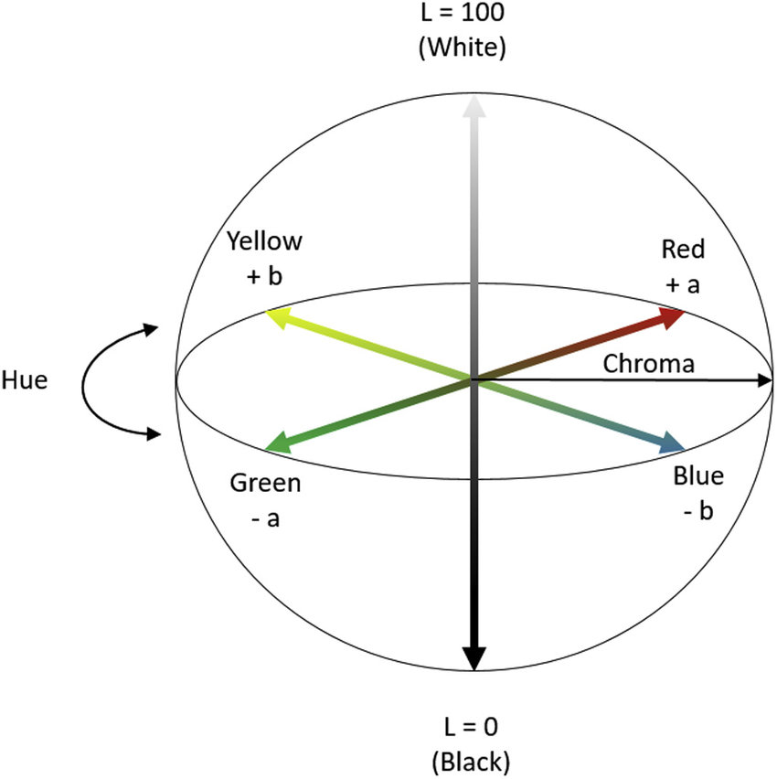
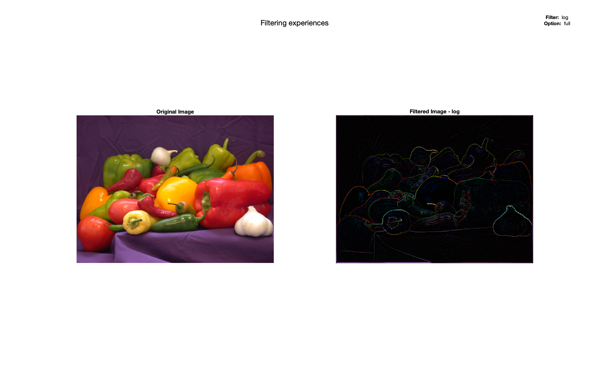

# Lab Assignment 2 - Introduction to visual signal processing

---

- Inês Alexandre Queirós Matos Macedo de Oliveira - 202103343
- Pedro Nuno Ferreira Moura de Macedo - 202007531

---

## Task 1 - Experiments with colors spaces

The purpose of this task is to use the four different color spaces: RGB (Red, Green, Blue), HSV (Hue, Saturaion, Value, where V represents brightness), YCrCb/YUV (luminance and color difference scales), and L\*a\*b\* (L is luminosity level, a is color channel along the greenred axis b is the color channal along the blue.yellow axis - no color can be simultaneously gree and red or blue and yellow).

#### Task 1.1 - RGB and HSV components

In this subtask, we are expected to perform a series of operations on images in different color spaces, RGB and YSV, using the Matlab properties. Lets see this in an image. 

Below it is an example of a normal image with a landscape.

    

Now, lets see the different color components of this image in an rgb color space.

    
    
    

In order to analyse this color components correctly, it is necessary to know that how much lighter the image section is, more predominant is the respective color in that area. For example, by looking at the original image and to the separated color components, we can draw some conclusions:

1. **Red Component (R)**: The red component is the darkest of the components, indicating that the red component is the least predominant color in the image. Yet, because the image is not completely dark, this suggests that there are still elements of red through the image (in this case, possibly in the rocks).
2. **Green Component (G)**: The green component is relatively darker overall, which may suggest, as the red component, that there are not a lot trace elements of green in the original image.
3. **Blue Component (B)**: The blue component is bright in regions where the original image is dominantly blue, such as the sky and the ocean. This indicates a high presence of blue in the original image. 
4. **Comparing color components**: By comparing the three color components, it's noticeable that the blue tones are the most predominant in the overall original image.
5. **Component details**: It's noticeable that in the blue components, the light reflection in the water is so strong that resulted in less detail due to the loss of information in the highlights. In contrast, the bigger rocks have more detail because they are less exposed to light than the water.

Now, lets analyse the behaviour of the components in a different color space, the HSV. The _H_ refers to **hue** (angle of the color), _S_ refers to **saturation** (colorfulness of a stimulus relative to its own brightness) and _V_ refers to **value** (attribute of a visual sensation according to which an area appears to emit more or less light).

     
    
    
    

In order to analyse this color components correctly, it is necessary to know that how much lighter the image section is, more predominant is the respective color in that area. For example, by looking at the original image and to the separated color components, we can draw some conclusions:

1. **Hue Component (H)**: This component captures the types of colors present in the original image. Different shades of gray correspond to different colors in the original scene. As we can see in the hue image, the lighter the gray is, the closest the color is to the respective primary color.

2. **Saturation Component (S)**: This component captures the intensity of the colors. Areas that appear brighter in the saturation image are more saturated in the original picture, indicating more vibrant and pure colors. As we can see in the puddle, this one is lighter which may indicate that the blue color is a lot saturated. In contrast, the black sand is darker which may reveal that the color of the sand is further from the respective primary color.

3. **Value Component (V)**: This component represents shows how light or dark the colors in the image are without hue. The lighter areas correspond to brighter regions in the original image, while darker areas represent darker regions (like shadows). For example, the upper part of the sky it's darker than the lower part of the sky (it's possible to see a gray gradient of the value component in the sky).

To get a better insight into the different types of color scales, lets see a different image:

    

Now, lets see the different color components of this image in an rgb color space.

    
    
    

In order to analyse this color components correctly, it is necessary to know that how much lighter the image section is, more predominant is the respective color in that area. For example, by looking at the original image and to the separated color components, we can draw some conclusions:

1. **Red Component (R)**: The red component is noticeably ligher in the biggest closest peppers in the original image, which may suggest that the red is predominat in this pepper.
2. **Green Component (G)**: The same things happens in this component as the red component. In the peppers that are further to the front of the image, the peppers are lighter because they are of the green color.
3. **Blue Component (B)**: The blue component is brighter in the background, because the background color is more approximated to blue than the color of all the peppers.
4. **Comparing color components**: By comparing the three color components, it's noticeable that the image has a lot of different colors. It is also possible to confirm that the blue color is the less present in the orignal image.
5. **Component details**: Because the original picture has a lot of light reflection in all elements, there is a lot of detial in all the elements.

Now, lets analyse the behaviour of the components in a different color space, the HSV. The _H_ refers to **hue** (angle of the color), _S_ refers to **saturation** (colorfulness of a stimulus relative to its own brightness) and _V_ refers to **value** (attribute of a visual sensation according to which an area appears to emit more or less light).

     
    
    
    

In the same way that we analyse the previous picture, let's draw some conclusions about this one:

1. **Hue Component (H)**: As we can see in the hue image, the red pepper is lighter than the yellow peppers because the hue angle of the color red is 0 while the angle of the color green is 120. This resulted in different hues in the image. 

2. **Saturation Component (S)**: As we can see in the red pepper, it's noticeable that the saturation levels on the top of the pepper are more than in the middle part of the pepper.

3. **Value Component (V)**: As we can see in the value image, the garlic in the front of the image is much lighter than the peppers, because it's brighter than the other elements of the image. In contrast, we can see the different gray scales from the pepper above the garlic. The gray tone in the peppers is much gray than the the gralic. 

#### Task 1.2 - RGB and YCbCr components

In this subtask, we are expected to perform a series of operations on images in different color spaces, RGB and YCbCr, using the Matlab properties.
In order to analyse the behaviour of the components in a different color space, the YCbCr. The _Y_ refers to **luminance** or **brightness** (colors increase in brightness as _Y_ increases, also knwown as _luma_), _Cb_ refers to **blue chrominance** (indicates the difference between the blue component and a referenced value) and _Cr_ refers to **red chrominance** (indicates the difference between the red component and a referenced value). The values of _Cb_ can be calculate as follows, `Cb = -0.169 * R - 0.331 * G + 0.500 * B`, which emphasizes the blue color. Similar to this, the _Cr_ can be calculated using the formula, `Cr = 0.500 * R - 0.419 * G - 0.081 * B`, which emphasized the red color. Lets see this in an image.

     

In the above image, we can see that lower values of _Cb_ and _Cr_ are in the lower left corner of this plane, which is where shades of green can be found. 
Below is an example of a normal image with a landscape.

    

Now, lets see the different color components of this image in an rgb color space.

     
    
    
    

By looking at the original image and to the separated color components, we can draw some conclusions:

1. **Luminance (Y)**: By comparing the luminance of the puddle of water and the sand, we notice that the puddle of water is lighter than the sand, which may indicate that the sand is more illuminated than the sand.

2. **Blue chrominance (Cb)**: In the image, we can see the level of blue in relation to the luminace (_Y_) of the image. It represents the amount of blue is present relative to the luminance. In this grayscale image, the areas that appear ligther indicate regions with less blue relative to brightness, and darker areas indicate more blue relative to brightness. For example, in the original image, the sky is a vibrant blue, with a blue gradient. In the _Cb_ component image, the high level of blue (in this case, is in the upper part of the sky) makes the blue chrominace to be high (darker in gray scale). While in the lowest part of the sky, the blue color is not so strong, so it makes the blue chrominance to be lower than the upper part of the sky (lighter in gray scale).

3. **Red chrominance (Cr)**: Similar to the _Cb_ explanation, this chrominance represents the amount of red present relatively to the luminance. In this grayscale image, the areas that appear ligther indicate regions with less red relative to brightness, and darker areas indicate more red relative to brightness. For example, some parts of the rocks (mostly the shadows) have a darker redish color, for the same luminance, which makes the chrominance to be higher in this high red level regions. So, the areas of the rocks that appear to be darker, have the _Cr_ component higher (which makes the gray scale darker).

To get a better insight into the different types of color scales, lets see a different image:

    

Now, lets see the different color components of this image in an YCbCr color space.

     
    
    
    

By looking at the original image and to the separated color components, we can draw some conclusions:

1. **Luminance (Y)**: As said before, the _Y_ component represents the luminance or brigthness of the image. In this image, for example, it's noticeable that the yellow pepper is receving more luminance than the other peppers which makes the peppers to have a more white colors than the other peppers in the _Y_ component image. But, overall, the luminance is almost equal throughout the all image and its components.

2. **Blue chrominance (Cb)**: As also said before, the _Cb_ chrominance refers to the difference between the blue part of the image and the luminance. A darker are means that more blue is present relative to the luminance, and a lighter area means less blue. For example, the blusish background is way ligther than the peppers because it's the only thing close to the blue color in the image. Also, another great example is te yellow pepper. The yellow peppers presents a lot darker in the _Cb_ component image because the yellow color is the opposite of the blue color in the YCbCr color space, as it can be seen below.

    

3. **Red chrominance (Cr)**: Similar to the previous image example, the landscape, the red color will have darker gray regions on the _Cr_ component image. For example, the red peppers almost in the front of the image has a realy light gray region due to the high presence of red in that pepper region. In this case, the cyan color would present the darkest regions of the component image, because its the opposite color of red. It's noticeable that the green peppers are a lot darker than the rest of the peppers, due to the fact that the primary colors that are closest to the cyan color are the green and blue, which makes the green and the blue colors in this component a lot gray ligther than the other elements of the image.

#### Task 1.3 - RGB and L\*a\*b\* components

In this subtask, we are expected to perform a series of operations on images in different color spaces, RGB and L\*a\*b\*, using the Matlab properties.

In order to analyse the behaviour of the components in a different color space, the L\*a\*b\*. The _L_ refers to **lightness** (represented on a vertical axis with values from 0, black, to 100, white), _a\*_ refers to **red/green value** (the negative axis is green and the positive axis is red) and _b\*_ refers to **blue/yellow value** (the negative axis is blue and the positive axis is yellow). 

    

In order to understand the L\*a\*b\* color space, lets see it in an image.

    

Now, lets see the different color components of this image in an L\*a\*b\* color space.

     
    
    
    

1. **Lightness (L\*)**: Almost all of the elemnts in the original image are very lightned, so in the _L_ image it will appear almost all white (due to the high presence of light in the original image). It's also noticeable that some elements of the original image got darker in the _L_ component. For example, the rocks on the sand present a grayer tone due to the fact that has less light than the other elements (the rocks have shadows). Because the most predominant color in the original image is blue (which is neutral in the _a_ component), this component may not be as much contrast as the _b_ component in this particular image. Still, it's a little noticeable the presence of the red color in the bigger rocks (because they are darker in the _a_ component graph), which may indicate a strong presence of the color red in the bigger rocks.

2. **Red/Green value (a\*)**: Negative values indicate green while positive values indicate red. In the _a_ component image, areas that appear darker might indicate a strog presence of green, and areas that appear lighter may indicate a strong presence of red. 

3. **Yellow/Blue value (b\*)**: Negative values indicate blue while positive values indicate yellow. In the _b_ component image, areas that appear darker might indicate a strog presence of blue, and areas that appear ligther may indicate a strong presence of yellow. In the original image, the predominant color is blue, which may be confirmed by looking at the _b_ component. For example, the sky and the puddle of water are a lot darker than the other elements (as the rocks), which indicates that they have a strong presence of the blue color (which can be confirmed in the original image).

To get a better insight into this type of color scale, _YCbCr_, lets see a different image:

    

Now, lets see the different color components of this image in an YCbCr color space.

     
    
    
    

By looking at the original image and to the separated color components, we can draw some conclusions:

1. **Lightness (L\*)**: The _L_ component image is almost entirely white, which may indicate that the majority of the original image has high luminance. This correlates with the original image being bright and have vibrant colors, which suggest that the original image is well lit with few dark shadows.

2. **Red/Green value (a\*)**: In the _a_ component image shows significant darker areas, suggesting that there are regios with a stronger green presence, while others are ligther which may indicate a strong red presence. For example, the different color peppers have significant color constrasts in this components. The red pepper is ligther while the green peppers are darker.

3. **Yellow/Blue value (b\*)**: In the _b_ component image shows significant contrast between the background and the peppers. In this component, the darker areas represent a strong presence of blue, while ligther areas represent a strong presence of yellow. The _b_ component image can confirm this assumption since the only element that is darker is the background (which has a color near to the blue primary color), while all of the peppers are white in this component (which indicates a low presence of blue in this elements).

#### Task 1.4 - Color histogram in the different color spaces

In this subtask, we are expected to compute the color histograms of the images in two different color spaces, RGB and L\*a\*b\*.

Starting with the landscape images.

    
    
    

The RGB histogram is:

     

In order to interpret this histogram is important to know that the x-axis represents the gray scale (the lowest value represents the black color, and the highest possible value represents the white color). From this histogram and this explanation, we can draw some conclusions:

1. **Red Channel**: The peak in lower values indicates a significant presence of darker red tones, which could be shadows or darker objects in the original image.
2. **Green Channel**: The more even distribution, with multiple peaks, suggests a variety of green tones, indicating a balanced presence of light and dark green tones.
3. **Blue Channel**: The peaks at the lower and very high ends suggests both deep blues (likely the sky or water) and very blues, which might correspond to highlights or reflections. Because the original image is mostly blue, this component will have a lot of white sections in the component image.

The L\*a\*b\* histogram is:

    

1. **L\* Channel (Luminance)**: The broad distribution of the peaks throughout the histogram, but rather in the middle of the histogram suggests that while there are bright areas in the original image, the majority of the image consists of midtones, and the image has well balanced between light and dark areas.
2. **a\* Channel (Red/Green value)**: In this component, it's possible to confirm that there are more peaks in the positive axis than in the negative axis. This means that in the original image there is more present the red color than the green color. This can be confirmed just by looking to the _a_ component image, by checking that there are more light areas (less dark areas represent more tons of red).
3. **b\* Channel (Yellow/Blue value)**: In this component, it's possible to notice that there are way more peaks in the negative axis than in the positive axis. This could mean that there are more areas near the blue color than the yellow color. This can be true since the image that is being analysed has a lot of blue tones. Also, in the _b\*_ component image is possible to notice that is almost entirely black which, as said previously, mean thatv there are more tones of blue than yellow.

To get a better insight into this two types of color scale, _RGB_ and _L\*a\*b\*_, lets see the RGB histogram of a different image (peppers image):

    

From this histogram and the previous explanation about how to interpret histograms, we can draw some conclusions:

1. **Red Channel**: In the histogram we can see that there are a lot of mid-tones of red, indicating a moderate presence of red values in the image. There is also a significant presence at the highest end of the scale, which corresponds to an area where the color red is predominant (this high peak in the end of the histogram must be from all of the red peppers in the image).

2. **Green Channel**: In this histogram is possible to notice that the peaks are more centered with a good distribution around the mid-tones. This implies a balanced presence of green values in the image (this color is most present in the peppers).

3. **Blue Channel**: In the histogram of this component, the blue color of the background is not so strong as the blue primary color, which we can confirm by looking to the peaks that are located mostly on the start of the x-axis.

The L\*a\*b\* histogram of this image (peppers image) is:

    

1. **L\* Channel (Luminance)**: The component _L_ image is very bright, indicating the entire image has very high luminance, suggesting that the image is well lit. The peak that can be seen in the middle part of the histogram can suggest that the image has a good amount of midtone luminance.

2. **a\* Channel (Red/Green value)**: In this component, it's possible to see a central peak around 20 value, indicating that the image has slightly more pixels falling on the positive side, which means a slight dominance of the red color tones over the green color tones. 

3. **b\* Channel (Yellow/Blue value)**: In this component, it's possible to notice a high peak between the range [-20,0] and way more peaks in the negative axis rather than the positive axis. This may suggest that there is a big dominance of the blue color tones than the yellow color tones (this can be confirmed by looking at the darker part of the b\* image component - the dark area represents the approximately the blue color, while the rest of the image is almost all white - parts of the image that are not even closr to the blue primary color).

## Task 2 - Variation of image spatial dimensions using or not filters with the “imzoneplate” test image

The purpose of this task is to use the enlarge/reduce a predefined image _imzoneplate_, that is generated by executing a pre-given file, _imzoneplate.m_.
It is also asked to test the program with different dimensions for the zoneplate image and to use different interpolation methods of the built-in function _imresize.m_ file. 
For the purpose of this task, we will due for three different dimensions (64, 128 and 256 pixeis) and for each of them all of the possible interpolation methods (_bicubic_, _bilinear_, _box_, _cubic_, _lanczos2_, _lanczos3_, _nearest_ and _triangle_).
Let's start by cehcking the results obtained using different dimensions for the zoneplate image.

#### Task 2.1 - Size of 64

In this subtopic, the zoneplate image was created by proving a specific size of 64x64 pixeis. The result zoneplate image is the following one:

    

Now, let's start by analysing the spectral density and the variation of signal in space of the original image.

    

    💡
    <strong>Tip</strong>

The spectral density graph is calculated by using the formula  

\[ Power Spectral Density (PSD) = \frac{|\text{FFT}|^2}{N^2} \]
\[ Power Spectral (PS) = \frac{|\text{FFT}|^2}{N^2} \]
\[ Equivalent Noise Band Width (ENBW) = f_s  * \frac
                    {\sum_{N}{|\text{FFT}_n|^2}}
                    {|\sum_{N}{\text{w(n)}}|^2} 
\]

where the FFT represents the _Fourier transform technique_.

You can learn more about this, by seeig the <a href="https://www.youtube.com/watch?v=pfjiwxhqd1M&ab_channel=MATLAB">video</a> and the <a href="https://www.mathworks.com/help/signal/ug/power-spectral-density-estimates-using-fft.html">link</a>.

In this graph, the z-axis represents the magnitude of the spatial frequencies in the image, while the x-axis and the y-axis represent the horizontal and vertical spacial frequencies, respectively. Peaks in the graphic correspond to frequencies where there is a strong presence of those spatial components in the image. For the _zoneplate_ image, which tipically contains concentric circles radiating outwards from the center, it's expected to see a series of peaks that correspond to the radial frequency of these circles. By looking to the graph, we can draw some conclusions:

1. As we can see in the spectral density graph, there is a peak in the center of the graph that might correspond to the center of the zoneplate image. 
2. As we move away from the center of the zoneplate image, the circles start to have a lower magnitude and become more sparse between them, until the point the magnitude is minimum and it's no longer possible to distinguish the circles levels (this can be confirmed by looking at the resized _zoneplate_ image, where as bigger the distance between the circle to the center, the less the magnitude is, and it becomes more difficult to distinguish them).

    

From this graph, we can draw some conclusions:

1. In the **variation of signal in space** graph of the original image, each bar's height indicates how frequently a particular range of signal variation occurs.
2. The varying heights of the bars reflect how the signal variation changes accross different spatial frequencies.
3. The height of the bars also represent the dark and ligth rings of the original zoneplate image.

Lets analyse this resampled image by using the **repetition method**:

Now, the spectral density image obtained was:

In this graph, we can see that the magnitude of the peaks stayed the same, but we  notice that the peaks are much bigger in terms of frequency due to the repetition of pixeis. This can lead to a more chaotic spectral density graph and a less smooth variation of signal graph.

In this graph, we can motice that the high of the bars increased due to the presence of more pixeis in the generated image. 

- **Higher bars** indicate a high frequency of certain pixel values. For the original _zoneplate_ image, this would correspond to the areas with consistent intensity, likely the broad bands of the concentric circles. 
- **Lower bars** represent fewer pixeis with that particular intensity, which may correspond to the transitions between the rings of the zoneplate where the gradient changes.

Now, we will analyse the different interpolation methods in this specific image. This method consist of repeting pixeis or removing pixeis from the original image in order to meet hte expected size inputed by the user. In this experiment, we used a constant resizing factor of 3. The obtained image was:

1. **Bicubic method**: The bicubic operation is a technique used to smoother out images during the reseizing by considering the intensity values of 16 pixeis (in a 4x4 grid) to estimate the new pixel values. This method leads to smoother gradients than simpler methods like bilinear interpolation. Lets see the _imresize_ method:

    - **Image processed by imresize function**: This method returns the image resized with the specified dimensions by using the method specified (in this case, the **bicubic method**). The obtained image was:
        

        
        

        
        The spectral density image obtained was:
        

        
        

        

        In this graph, we can see that the magnitude of the peaks stayed the same, but we  notice that the peaks are much bigger in terms of frequency due to the repetition of pixeis. This can lead to a more chaotic spectral density graph and a less smooth variation of signal graph.

        

        
        

        
        
        In this graph, we can notice that the high differences between the bars are way lower than the differences between teh bars obtained in the same type of graph using the repetition method. Because this method calculates the new pixel values based on the surrounding pixels, this tends to distribute the intensity values more evenly. The _zoneplate_ obtained by using the bicubic method in the _imresize_ function gives a smoother appearance with less distortion.

    - **Comparing the two methods: pixels repetition and imresize function with the _bicubic_ method**: The _imresize_ with the _bicubic_ method tipically gives a more accurate and a higher-quality image that is more approximate to the origal image than the one obtained from the repetition method. The _imresize_ function is more computationally costly but produces an image with smoother transitions. Pixel repetition may be faster but it has less image quality, particularly in image with detailed textures, as the _zoneplate_ image.
 

2. **Bilinear method**: The bilinear operation is a technique used to scale images by calculating the value of a new pixel based on the weigthed average of the 2x2 nearest pixels to this new pixel. Lets see the _imresize_ method:

    - **Image processed by imresize function**: This method returns the image resized with the specified dimensions by using the method specified (in this case, the **bilinear method**). The obtained image was:
        

        
        

        
        The spectral density image obtained was:
        

        
        

        

        In this graph, we can see that the peaks are smoother than the obtained using the repetitino pixels method. 

        

        
        

        
        
        In this graph, we can notice that the distribution of the pixels is more consistent and uniform than the image obtained using the **repetition method**, which indicates a smoother transition between different levels of the image colors intensity. 

    - **Comparing to previous methods (bicubic)**: The **bicubic method** applies more complex calculations than the **bilinear method** which may result in smoother gradients and better final results. The bilinear method is overall good smothering the image, but not as good as the **bicubic method**, which considers more pixels in the interpolation process, which results in smoother images. However, the **bilinear method** is much faster and less computationally expensive than the **bicubic method**. 

3. **Box method**: The box operation is a technique used to scale images by averaging pixels within the specified window/box size. This method is more useful for downsampling, than for upscaling, which can lead to a loos of detail. Lets see the _imresize_ method:

    - **Image processed by imresize function**: This method returns the image resized with the specified dimensions by using the method specified (in this case, the **bilinear method**). The obtained image was:
        

        
        

        
        The spectral density image obtained was:
        

        
        

        

        In this graph, we can see that there is less smoothing of teh spatial frequencies when compared to **bilinear** or **bicubic** interpolation methods. This resulted in a more pixelated image, with less image quality.

        

        
        

        
        
        In this graph, we can notice that there are a lot of brutal changes between each bar, which may be caused by the **box** inteprolation method, since this method gives the pixel the average value of the NxN nearest pixels neighbours.

    - **Comparing to previous methods (bicubic and bilinear)**: When resizing an image, the **box method** may mantain sharp edges (due to the fact that it averages the values of the surrounding pixels) but also introduces a pixelized image. This pixelized problem can be solved by using the **bilinear method**, which smooths the transitions between the pixels. The **bicubic method** is the best of the three in terms of image quality, providing smoothest results, with less distortion and preservation of details.

4. **Cubic method**: The **bicubic method** is similar to the **bicubic method**. Lets see the _imresize_ method:

    - **Image processed by imresize function**: This **bicubic method** uses this method. The obtained image was:
        

        
        

        
        The spectral density image obtained was:
        

        
        

        

        

        
        

        
        
        In this graphs, we can notice that they are a lot similar to the ones obtained in the **bicubic method** since this method uses the **cubic method**.

    - **Comparing to previous methods (bicubic, bilinear and box)**: When resizing an image, the **cubic method** does not present so much differences from the **bicubic method**, as explained earlier. The **cubic method**, being a one-dimensional approach, might produce results with sharper transitions compared to the **bilinear method**. While the **cubic method** is less pixelized than the **bilinear method**, the execution time is slower and has more complexity. The **cubic method** achieves smoother pixels transitions when compared to the **box method**, although is much slower and complex. 

5. **Lanczos2 method**: The **lanczos method** is a technique used to scale images by applying a <a href="https://en.wikipedia.org/wiki/Sinc_function">sinc-based</a> convolution kernel, specially designed to preserve details while minimizing the pixelization if the result image. The **lanczos2 method** operates within a window of 2 regions on the sides of the pixel being interpolated (this is, makes a window od 4x4 pixels surrounding the interpolation point). Lets see the _imresize_ method:

    - **Image processed by imresize function**: This **lanczos2 method** uses thie _lanczos method_ . The obtained image was:
        

        
        

        
        The spectral density image obtained was:
        

        
        

        

        

        
        

        
        
        In this graphs, we can notice that they are a lot similar to the ones obtained in the **bicubic method** since this method uses the **cubic method**.

        - **Comparing to previous methods (bicubic, bilinear, box and cubic)**: The **bicubic method** is smoother than the **lanczos2 method**, but it's less sharp. The **bilinear method** is much faster, but it's much less sharp than the **lanczos2 method**. The **box method** is a lot more pixelized than the **lanczos2 method**. The **cubic method** is preferred for upscaling the image when speed is important and sharpness is not necessary. The **lanzcos2 method** is preferred in scenarios where the details are the most important aspect of the final images.

6. **Lanczos3 method**: The **lanczos method** is a technique used to scale images by applying a <a href="https://en.wikipedia.org/wiki/Sinc_function">sinc-based</a> convolution kernel, specially designed to preserve details while minimizing the pixelization if the result image. The **lanczos3 method** operates within a window of 3 regions on the sides of the pixel being interpolated (this is, makes a window od 9x9 pixels surrounding the interpolation point). Lets see the _imresize_ method:

    - **Image processed by imresize function**: This **lanczos2 method** uses thie _lanczos method_ . The obtained image was:
        

        
        

        
        The spectral density image obtained was:
        

        
        

        

        

        
        

        
        
        In this graphs, we can notice that they are a lot similar to the ones obtained in the **bicubic method** since this method uses the **cubic method**.

        - **Comparing to previous methods (bicubic, bilinear, box, cubic and lanczos2)**: The differences between the **lanczos3** from the **bicubic**, **bilinear**, **box** and **cubic** methods are very similar to the differences between the **lanczos2** and this other methods (bicubic, bilinear, box and cubic methods). The difference between the **lanczos2 method** and the **lanczos3 method** is that the **lanczos3 emthod** as a lot more detail and it's sharper than the **lanczos2 method** becuase of its winder window.

7. **Nearest method**: The **nearest method** is a technique that determines the object that is closest to the location where . Lets see the _imresize_ method:

    

    
    

    For more details of this method, click <a href="https://theailearner.com/2018/12/29/image-processing-nearest-neighbour-interpolation/">here</a>.

    
    
    

    - **Image processed by imresize function**: This **nearest method** picks the nearest pixel to the target pixel. The obtained image was:
        

        
        

        
        The spectral density image obtained was:
        

        
        

        

        

        
        

        
        
        In this graphs, we can notice that they are a lot similar to the ones obtained in the **bicubic method** since this method uses the **cubic method**.

        - **Comparing to previous methods (bicubic, bilinear, box, cubic, lanczos2 and lanczos3)**: The **bicubic method** is much smoother and has better gradients scales when compared to the **nearest method**. The **bilinear method** is a little better than the **nearest method**, because it offers smoother pixels transitions whenc compared to the **nearest method** pixelized effect. The pixelized is mroe noticeable in significantly scaled images. The **box** and **cubic** methods have smoother pixels transitions than the **nearest method**. The **lanczos2** and **lanczos3** methods have better gradients scales when compared to the basic **nearest interpolation method**, but they are highly computationally intensive.

8. **Triangle method**: The **triangle method** is a technique used to scale images by applying the average value of the two nearest pixels. Lets see the _imresize_ method:

    - **Image processed by imresize function**: This method returns the image resized with the specified dimensions by using the method specified (in this case, the **triangle method**). The obtained image was:
        

        
        

        
        The spectral density image obtained was:
        

        
        

        

        In this graph, we can notice the frequency content of the image, which indicates the high detail and sharpness of the image.

        

        
        

        
        
        In this graph, we can notice that they are a lot changes between the different levels of frequency, but the difference of between the bars is lower which may result in a smoother gradient scale.

        - **Comparing to previous methods (bicubic, bilinear, box, cubic, lanczos2, lanczos3 and nearest)**: The **bicubic method** produces smoother gradients and fewer pixelation in the result image. The **bilinear method** takes into account the closes 4 pixels (2x2 pixels) rather than just 2 pixels (the trinagle vertices). The **box method** can result in a loss of detail in the final image, rather than the **trinagle method** which is likely to preserve more detail. The **cubic method** uses the average value of 16 neighbour pixels, while the **triangle method** only uses 2 pixels, which may result in a smoother result. The **lanczos2** and **lanczos3** methods preserved more detail than the **triangle method** because, for the same reason as almost of the other methods, it uses more pixels to calculate the taregt pixel value. The **nearest method** presents a rougher texture because it calculates the value of the target pixel by using the value of the nearest pixel to the target pixel.

#### Task 2.2 - Size of 512

In this subtopic, the zoneplate image was created by proving a specific size of 512x512 pixeis. The result zoneplate image is the following one:

    

Now, let's start by comparing this image with the _zoneplate_ image with dimensions 64x64 pixels. We approximated the inner circle of both _zoneplate_ images in order to get a better insight of the change:

    <figure>
        
        <figcaption>Zoneplate inner circle image with dimensions 64 by 64 pixels</figcaption>
    </figure>
    <figure>
        
        <figcaption>Zoneplate inner circle image with dimensions 512 by 512 pixels</figcaption>
    </figure>

By comparing the obtained images for different _zoneplate_ images dimensions, we can draw some conclusions:

1. It's noticeable that the image resolution increase by increasing the number of pixels of the _zoneplate_ image. The higher resolution of the right side image provides a much smoother visual experience. 
2. On the image with 512x512 resolution, the details are clearly more visible. The inner circles are rendered smoothly, which will probably result in a more accurate representation in both spacial and frequency representations. 

    

Now, let's compare the spectral density graphs obtained from both sizes, 64x64 pixels and 5121x512 pixels.

    <figure>
        
        <figcaption>Spectral density of image with dimensions 64 by 64 pixeis</figcaption>
    </figure>
    <figure>
        
        <figcaption>Spectral density of image with dimensions 512 by 512 pixeis</figcaption>
    </figure>

By comparing both of the spectral density graphs obtained for the two dimensions, 64x64 and 512x512 pixels, we can draw some conclusions:

1. The spectral density graph of the _zoneplate_ image with the higher resolution (the image on the right side) covers a wider range of frequencies with more subtle variations between them, which makes the image circles smoother and allows to capture better details. 
2. The higher the resolution of the image (image on the right side), more complex and denser frequency bars are in the spectral density graph.
3. Because the inteprolation methods have more data to work on when using an image with 512x512 pixels dimensions, this interpolation methods can produce a higher quality output image (less pixelized).

Now, let's compare the variation of signal in space graphs obtained from both sizes, 64x64 pixels and 5121x512 pixels.

    <figure>
        
        <figcaption>Variation of signal in space of image with dimensions 64 by 64 pixeis</figcaption>
    </figure>
    <figure>
        
        <figcaption>Variation of signal in space of image with dimensions 512 by 512 pixeis</figcaption>
    </figure>

By comparing both of the variation of signal in space graphs obtained for the two dimensions, 64x64 and 512x512 pixels, we can draw some conclusions:

1. The variaton of signal in space of the image with 512x512 pixels contains more detailed information which is reflected in the number of frequency bar variations. While the lower resolution image implifies the variation of signal and, as a result, only more significant changes in intensity are captured, leading to a bigger variations differences between the frequency bars.
2. In the right image, is not so noticeable the difference between the frequency bars and presents a smoother frequency change effect. 

Also, for the other interpolation methods, the differences between both resolutions will be the same as the ones mention in the inteprolation method above. You can see the graphs in the [annexes](#annexes) section below.

## Task 3 - Filtering experiences

In this task, we must develop a simple program that performs different types of image filtering using different types of options that control the filtering operation. Firstly, lets explain the different types of image filters:

1. **Average Filter**: Smooths the image by averaging he pixels with a kernel window.
2. **Disk Filter**: It's similar to the average filter but uses a circular kernel window.
3. **Gaussian Filter**: Reduces image noise and detail by giving more weight to the central pixels within the kernel window.
4. **Laplacian Filter**: Enhances the edges by calculating he second derivate of the image, highlighting regions of high intensity change (you can ger more insights about this type of image filtering by clicking <a href="https://medium.com/@vaibhav1403/sobel-filter-prewitt-filter-and-the-laplacian-filter-d3b8995c13#86cd">here</a>).
5. **Log filter**: Combines the **Gaussian filter** with the **Laplacian filter** in order to reduce noise before the edges of the image.
6. **Motion Filter**: Simulates the effect of motion blur in a specific direction, as if the camera was moving when the photo was taken. 
7. **Prewitt Filter**: This filter emphasizes horizontal differences by applying a specific kernel window (you can get more insigth about how to calculate the final image by clicking <a href="https://dsp.stackexchange.com/questions/40928/how-to-apply-prewitt-edge-detection-algorithm-on-a-given-image#answer-40953">here</a>).
8. **Sobel Filter**: Similar to the **Prewitt filter** but this one emphasizes more the vertical differences (you can ger more insights about this type of image filtering by clicking <a href="https://medium.com/@vaibhav1403/sobel-filter-prewitt-filter-and-the-laplacian-filter-d3b8995c13#f1f0">here</a>).

Now, lets explain the different types of options that mention of the filter will work:

1. **Symmetric Option**: Extends the image by mirroring it across its border.
2. **Replicate Option**: Extends the image by repeating the values at the edge of the image.
3. **Circular Option**: Extends the image by implicitly assuming the image is periodic.
4. **Same Option**: The output image is the same size as the input image (fefault behaviour if no option specified)
5. **Full Option**: This option gives the complete image f the filtering operation, without trimming the edges. This means that the output image will be larger than the input image.
6. **Corr Option**: The **correlation option** is the process of sliding the filter across the image and computing the sum of products at each position.
7. **Conv Option**: The **convolution option** is similar to the **correlation option**, but involves flipping the filter both horizontally and vertically before applying it.

In order to have a better understanding of the behaviours of the type of filters and options, lets see some image filtering cases:

- **Average Filter**
    

        <figure>
            
            <figcaption><strong>Average</strong> filter with <strong>Symmetric</strong> option</figcaption>
        </figure>
    

    In the **average filter**, we can notice that this filter smoothed the image by averaging the pixels within the local neighborhood.
 

- **Disk Filter**
    

        <figure>
            
            <figcaption><strong>Disk</strong> filter with <strong>Symmetric</strong> option</figcaption>
        </figure>
    

    In the **disk filter**, we can notice that this filter has blurred the image (like the previous filter, the **average filter**), but mantained the integrity of the object shapes.

- **Gaussian Filter**
    

        <figure>
            
            <figcaption><strong>Gaussian</strong> filter with <strong>Symmetric</strong> option</figcaption>
        </figure>
    

    In the **gaussian filter**, we can notice that the centre pixels are more detailed due to the fact that this filter gives more weight to pixels near the center of the image. This resulted in a smoother blur when compared to the **average** and **disk** filters.

- **Laplacian Filter**
    

        <figure>
            
            <figcaption><strong>Laplacian</strong> filter with <strong>Symmetric</strong> option</figcaption>
        </figure>
    

    In the **laplacian filter**, we can notice that the filter highlites edges and transitions intensity. in this image, the edges are highlighted as lighter or darker lines against a dark background. The image gets darker since his filter responds to the rate of change in brightness, and in areas without rapid change (the peppers surface), the result is close to zero, hence the darkness. The lighter lines refer to the places where there as a rapid change in brightness intensity.

- **Log Filter**
    

        <figure>
            
            <figcaption><strong>Log</strong> filter with <strong>Symmetric</strong> option</figcaption>
        </figure>
    

    In the **log filter**, this filter applies the **gaussian filter** to smooth the image and then the **laplacian filter** to detect the edges of the objects. So, this filter, as we can see in the image above (right image), preserves more details in the edge regions when compared to the **laplacian filter**.

- **Motion Filter**
    

        <figure>
            
            <figcaption><strong>Motion</strong> filter with <strong>Symmetric</strong> option</figcaption>
        </figure>
    

    In the **motion filter**, this filter simulates motion blur, as if the image has been captured with a moving camera. It's noticeable the slight distortion of the image obejcts.

- **Prewitt Filter**
    

        <figure>
            
            <figcaption><strong>Prewitt</strong> filter with <strong>Symmetric</strong> option</figcaption>
        </figure>
    

    In the **prewitt filter**, this filter is similar to the **laplacian filter** but emphasizes the edges with less intensity. The contrary difference of the images to this explanation can be due to the fact that the **laplacian filter** could produce an image with reduced brightness, making the edges less visible.

- **Sobel Filter**
    

        <figure>
            
            <figcaption><strong>Sobel</strong> filter with <strong>Symmetric</strong> option</figcaption>
        </figure>
    

    In the **sobel filter**, this filter is similar to the **prewitt filter** but gives more enphase to the pixels that are closer to the center. In the image obtained from the **sobel filter**, it's possible to notice that in the pepper of the middle, the "_blue_" color  is more "intense" than the blue color of the image obtained from the **prewitt filter**, which indicates that the **sobel filter** actually gives more enphase to the pixels that are closer to the center.

Now, lets see some different types of filter options that control de filtering operation (for this purpose, we will use the **average filter**):

- **Symmetric option**:
    

        <figure>
            
            <figcaption><strong>Average</strong> filter with <strong>Symmetric</strong> option</figcaption>
        </figure>
    

    In the **symmetric option**, this option reflects the image along the edges, essentially duplicating and inverting the pixels at the border. This lead to a result image where the edges at the border are smoother.

- **Replicate option**:
    

        <figure>
            
            <figcaption><strong>Replicate</strong> filter with <strong>Symmetric</strong> option</figcaption>
        </figure>
    

    In the **symmetric option**, this option replicates the border pixels across the border of the image, which is noticeable in the margins of the picture that are darker than the **symmetric option**, where the edges were copied.

- **Circular option**:
    

        <figure>
            
            <figcaption><strong>Circular</strong> filter with <strong>Symmetric</strong> option</figcaption>
        </figure>
    

    In the **circular option**, this option treats the image by connecting the left edge to the right and the top to the bottom. It's possible to notice this by obersving the image above. In the margins, it's possible to see that, for example, the bottom left part went to the top left part, and the top left part went to the bottom left part. 

- **Same option**:
    

        <figure>
            
            <figcaption><strong>Circular</strong> filter with <strong>Same</strong> option</figcaption>
        </figure>
    

    In the **same option**, in this option the output image is the same size as the input image, and the value at the border are handled in such a way (often by replication) to mantain this size. In the output image, it's possible to notice in the margins the margin pixels replication (black pixels).

- **Full option**:
    

        <figure>
            
            <figcaption><strong>Circular</strong> filter with <strong>Full</strong> option</figcaption>
        </figure>
    

    In the **full option**, the result of this option is similar to the one returned by the **same option**. However, the filtering is done in a way that the entire kernel is used , even at the borders. In the returned image, it's possible to see that this filter resulted in a larger image, as the filtering in the borders includes the full area of the kernel. 

- **Corr option**:
    

        <figure>
            
            <figcaption><strong>Circular</strong> filter with <strong>Corr</strong> option</figcaption>
        </figure>
    

    In the **corr option**, also known as **correlation option**, a correlation formula is used to determine he new pixel values at the edges. In the resulted image, it's also possible to see the new pixels in the margins of the image. 

- **Conv option**:
    

        <figure>
            
            <figcaption><strong>Circular</strong> filter with <strong>Conv</strong> option</figcaption>
        </figure>
    

    In the **conv option**, also known as **convolution option**, the process is similar to the **correlation option** (also the output imagess of this two options are similar). It performs multidimensional filtering using convolution. In the result image, it's also possible to notice the darker pixels at the margin, that were possibly calculate using a predefined formula in the convolution process.

## Conclusion

The **qunatisation process** refers to the process of constraining an input from a large set to output in a smaller set. This process evolves reducing the number of bits needed to store the color of each pixel.
The **dithering technique** is a technique that can be used to make a lower bit-depth blend colors by introducing random noise to the image n strategic locations. 

    <figure>
        
        <figcaption><strong>Dithering</strong> technique example</figcaption>
    </figure>

The **dithering technique** is useful because it reduces the effects of pixel-to-pixel errors in the flat field, and helps to remove quantisation distortion that occurs when reducing the number of bits. This technique creates an illusion of richer color depth n images with a reduced color palette.
The **filtering process** is the process of manipulating images to improve the qualilty of the image and suppress unwanted noise. There are a vast amount of filter types and options to choose depending on the requirements. Effective filtering improves image quality for better interpretation, but it's important to measure the values of the paramters since they can also introduce errors (and noise) in the result image.

## Annexes

#### Annex A: Experiments with colors spaces

###### Annex A.1: RGB and HSV components (ex1)

- *elephant.bmp* file:

    

    <figure>
    
    <figcaption>Elephant.bmp file in grayscale image</figcaption>
    </figure>
    

- *floresVermelhas.bmp* file:

    

    
    

    

    
    

    

    
    

    

    
    

    

    
    

    

    
    

    

    
    

    

    
    

    

    
    

- *folhasVerdes.bmp* file:

    

    
    

    

    
    

    

    
    

    

    
    

    

    
    

    

    
    

    

    
    

    

    
    

    

    
    

- *lighthouse.png* file:

    

    
    

    

    
    

    

    
    

    

    
    

    

    
    

    

    
    

    

    
    

    

    
    

    

    
    

- *peppers.png* file:

    

    
    

    

    
    

    

    
    

    

    
    

    

    
    

    

    
    

    

    
    

    

    
    

    

    
    

- *praia.bmp* file:

    

    
    

    

    
    

    

    
    

    

    
    

    

    
    

    

    
    

    

    
    

    

    
    

    

    
    

###### Annex A.2: RGB and YCbCr components (ex2)

- *elephant.bmp* file:

    

    <figure>
    
    <figcaption>Elephant.bmp file in grayscale image</figcaption>
    </figure>
    

- *floresVermelhas.bmp* file:

    

    
    

    

    
    

    

    
    

    

    
    

    

    
    

    

    
    

    

    
    

    

    
    

    

    
    

- *folhasVerdes.bmp* file:

    

    
    

    

    
    

    

    
    

    

    
    

    

    
    

    

    
    

    

    
    

    

    
    

    

    
    

- *lighthouse.png* file:

    

    
    

    

    
    

    

    
    

    

    
    

    

    
    

    

    
    

    

    
    

    

    
    

    

    
    

- *peppers.png* file:

    

    
    

    

    
    

    

    
    

    

    
    

    

    
    

    

    
    

    

    
    

    

    
    

    

    
    

- *praia.bmp* file:

    

    
    

    

    
    

    

    
    

    

    
    

    

    
    

    

    
    

    

    
    

    

    
    

    

    
    

###### Annex A.3: RGB and L\*a\*b\* components (ex3)

- *elephant.bmp* file:

    

    <figure>
    
    <figcaption>Elephant.bmp file in grayscale image</figcaption>
    </figure>
    

- *floresVermelhas.bmp* file:

    

    
    

    

    
    

    

    
    

    

    
    

    

    
    

    

    
    

    

    
    

    

    
    

    

    
    

- *folhasVerdes.bmp* file:

    

    
    

    

    
    

    

    
    

    

    
    

    

    
    

    

    
    

    

    
    

    

    
    

    

    
    

- *lighthouse.png* file:

    

    
    

    

    
    

    

    
    

    

    
    

    

    
    

    

    
    

    

    
    

    

    
    

    

    
    

- *peppers.png* file:

    

    
    

    

    
    

    

    
    

    

    
    

    

    
    

    

    
    

    

    
    

    

    
    

    

    
    

- *praia.bmp* file:

    

    
    

    

    
    

    

    
    

    

    
    

    

    
    

    

    
    

    

    
    

    

    
    

    

    
    

###### Annex A.4: Color histogram in the different color spaces (ex4)

- *elephant.bmp* file:

    

    
    

- *floresVermelhas.bmp* file:

    

    
    

- *folhasVerdes.bmp* file:

    

    
    

- *lighthouse.png* file:

    

    
    

- *peppers.png* file:

    

    
    

- *praia.bmp* file:

    

    
    

#### Annex B: Variation of image spatial dimensions using or not filters with the “imzoneplate” test image

###### Annex B.1: Size of 64

- Bicubic method

    

    
    

    

    
    

    

    
    

    

    
    

    

    
    

    

    
    

    

    
    

- Bilinear method

    

    
    

    

    
    

    

    
    

    

    
    

    

    
    

    

    
    

    

    
    

- Box method

    

    
    

    

    
    

    

    
    

    

    
    

    

    
    

    

    
    

    

    
    

- Cubic method

    

    
    

    

    
    

    

    
    

    

    
    

    

    
    

    

    
    

    

    
    

- Lanczos2 method

    

    
    

    

    
    

    

    
    

    

    
    

    

    
    

    

    
    

    

    
    

- Lanczos3 method

    

    
    

    

    
    

    

    
    

    

    
    

    

    
    

    

    
    

    

    
    

- Nearest method

    

    
    

    

    
    

    

    
    

    

    
    

    

    
    

    

    
    

    

    
    

- Triangle method

    

    
    

    

    
    

    

    
    

    

    
    

    

    
    

    

    
    

    

    
    

###### Annex B.2: Size of 128

- Bicubic method

    

    
    

    

    
    

    

    
    

    

    
    

    

    
    

    

    
    

    

    
    

- Bilinear method

    

    
    

    

    
    

    

    
    

    

    
    

    

    
    

    

    
    

    

    
    

- Box method

    

    
    

    

    
    

    

    
    

    

    
    

    

    
    

    

    
    

    

    
    

- Cubic method

    

    
    

    

    
    

    

    
    

    

    
    

    

    
    

    

    
    

    

    
    

- Lanczos2 method

    

    
    

    

    
    

    

    
    

    

    
    

    

    
    

    

    
    

    

    
    

- Lanczos3 method

    

    
    

    

    
    

    

    
    

    

    
    

    

    
    

    

    
    

    

    
    

- Nearest method

    

    
    

    

    
    

    

    
    

    

    
    

    

    
    

    

    
    

    

    
    

- Triangle method

    

    
    

    

    
    

    

    
    

    

    
    

    

    
    

    

    
    

    

    
    

###### Annex B.3: Size of 256

- Bicubic method

    

    
    

    

    
    

    

    
    

    

    
    

    

    
    

    

    
    

    

    
    

- Bilinear method

    

    
    

    

    
    

    

    
    

    

    
    

    

    
    

    

    
    

    

    
    

- Box method

    

    
    

    

    
    

    

    
    

    

    
    

    

    
    

    

    
    

    

    
    

- Cubic method

    

    
    

    

    
    

    

    
    

    

    
    

    

    
    

    

    
    

    

    
    

- Lanczos2 method

    

    
    

    

    
    

    

    
    

    

    
    

    

    
    

    

    
    

    

    
    

- Lanczos3 method

    

    
    

    

    
    

    

    
    

    

    
    

    

    
    

    

    
    

    

    
    

- Nearest method

    

    
    

    

    
    

    

    
    

    

    
    

    

    
    

    

    
    

    

    
    

- Triangle method

    

    
    

    

    
    

    

    
    

    

    
    

    

    
    

    

    
    

    

    
    

###### Annex B.4: Size of 512

- Bicubic method

    

    
    

    

    
    

    

    
    

    

    
    

    

    
    

    

    
    

    

    
    

- Bilinear method

    

    
    

    

    
    

    

    
    

    

    
    

    

    
    

    

    
    

    

    
    

- Box method

    

    
    

    

    
    

    

    
    

    

    
    

    

    
    

    

    
    

    

    
    

- Cubic method

    

    
    

    

    
    

    

    
    

    

    
    

    

    
    

    

    
    

    

    
    

- Lanczos2 method

    

    
    

    

    
    

    

    
    

    

    
    

    

    
    

    

    
    

    

    
    

- Lanczos3 method

    

    
    

    

    
    

    

    
    

    

    
    

    

    
    

    

    
    

    

    
    

- Nearest method

    

    
    

    

    
    

    

    
    

    

    
    

    

    
    

    

    
    

    

    
    

- Triangle method

    

    
    

    

    
    

    

    
    

    

    
    

    

    
    

    

    
    

    

    
    

#### Annex C: Filtering experiences

###### Annex C.1: Average filter

###### Annex C.2: Disk filter

###### Annex C.3: Gaussian filter

###### Annex C.4: Laplacian filter

###### Annex C.5: Log filter

###### Annex C.6: Motion filter

###### Annex C.7: Prewitt filter

###### Annex C.8: Sobel filter

