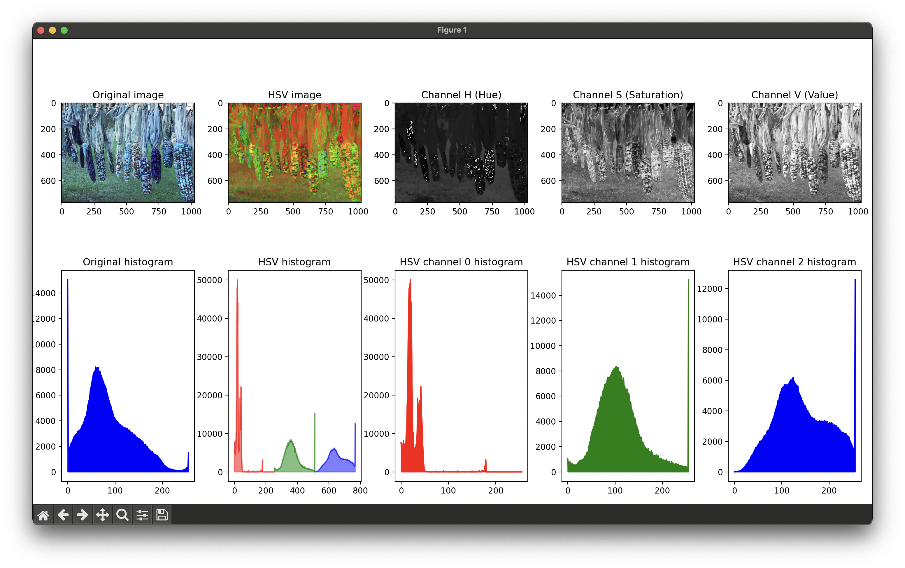
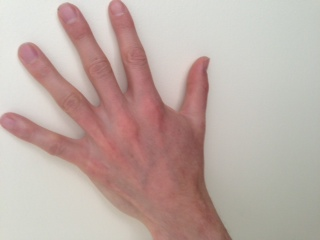
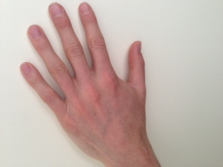
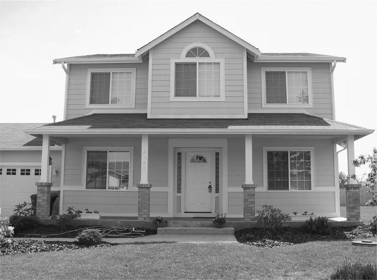
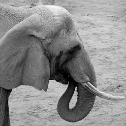
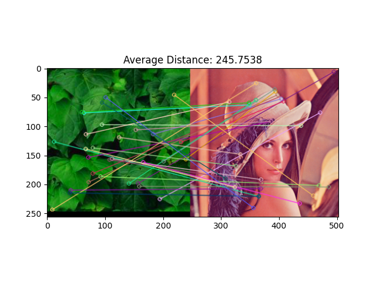
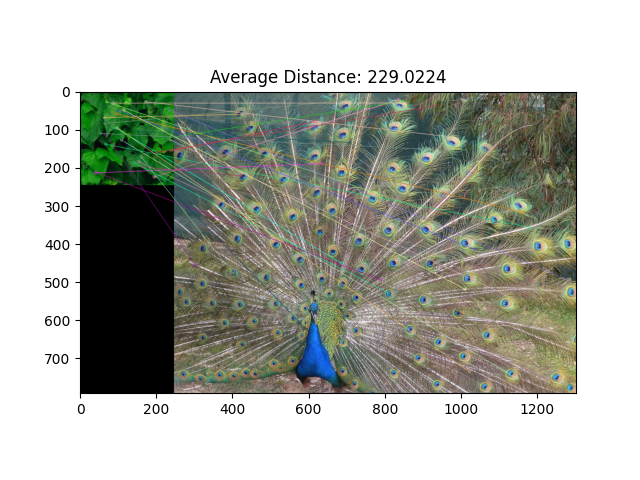
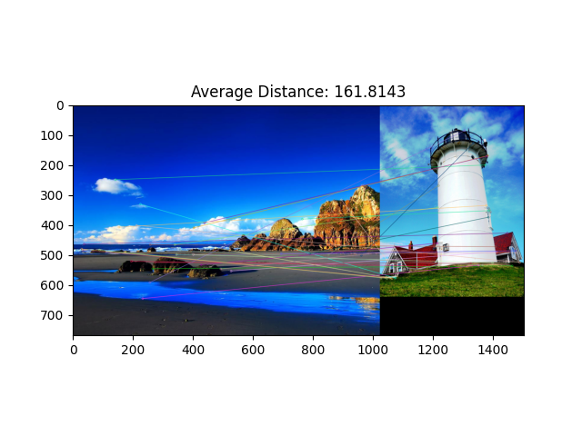

# Lab Assignment 3 - Comparing visual signals

---

- Inês Alexandre Queirós Matos Macedo de Oliveira - 202103343
- Pedro Nuno Ferreira Moura de Macedo - 202007531

---


# Task 1 - Experiments with color histograms for indexing and querying

The purpose of this task is to extract features from visual signals and use these features for comparison, in order to learn some basic techniques that can be used to index and query images. The main goal is to develop a program that returns the most similar images of a main image (passes as a user input to the program).

### Task 1.1 - Components histograms and single vector

In this subtask, we are expected to convert the images to HSV or L\*a\*b\* colors spaces, separate and plot the three different components of the image and, finally, concatenate the three histograms into one single vector. 

Below it is an example of the image that will be used in this subtask.

<div align="center">
    
</div>

Now, lets see the different color components histograms of this image.

<div align="center">
    
</div>

From this results, we can conclude that:

1. **Hue Component (H)**: This component captures the types of colors present in the original image. This histogram shows a peak at the lower hue value - typically reds or warm colours. This is concistent with the corn image, which as a lot of warm colours, specially the red and yellow tones in the corn cobs.

2. **Saturation Component (S)**: This component captures the intensity of the colors. This histogram has a broad distribution with a peak towards the higher end of the scale. This can suggest that the image has a good amount of vibrant colours, which also corresponds to the vibrant colours that can be observed in the original image.

3. **Value Component (V)**: This component represents shows how light or dark the colors in the image are without hue. This histogram is evenly distributed, with a slight inclination towards the end of the scale. This can indicate that the image has a wide range of brightness levels but its generally well lit with more bright pixels than dark. 
   
4. **Overall analysis**: In the histograms we can see a predominance of bright, saturated colors, especially within the red-yellow part of the color spectrum.


### Task 1.2 - Images comparison and vectors distance using different similarity metrics

In this subtask, we are expected to develop a script that concatenates vectors with colors histograms, evaluate the distance between the images, and conclude about the similarity of the images. in order to evaluate the similarity between the images, we used different distance metrics, such as the _Euclidean\_distance_, the _cosine\_similarity_ or _intersection\_distance_.

#### HSV color space

These were the images used in this subtask:

<div align="center">
    
    
</div>

The distances obtained were the following ones:

```bash
(env) ➜  src git:(main) ✗ python3 scripts.py 1.2 -img1 ../resources/car_1.jpg -img2 ../resources/car_2.jpg -cs HSV -d
Conclusion: The images are dissimilar

Euclidean distance: 0.17487722635269165
Cosine similarity: 0.43107616901397705
Intersection distance: 0.5726649165153503
```

Since the script didn't returned the images side by side, we can conclude that any of the images met the minimum threshold in order to assume the similarity between them. In the obtained results, we can see that the distance that considered the images to be the more similar was the _euclidean\_distance_, since if the distance is low, the similarity of the images is high.
Since both of the images have the same content and context, and the only difference between them is that _car\_1.jpg_ image is more well-lit than the _car\_2.jpg_ image, it's normal that the _euclidean\_distance_ is low (around 17.5%).

To get a better insight , lets see this in other two similar images:

<div align="center">
    
    
</div>

The distances obtained were the following ones:

```bash
(env) ➜  src git:(main) ✗ python3 scripts.py 1.2 -img1 ../resources/hands1.jpg -img2 ../resources/hands2.jpg -cs HSV -d
Conclusion: The images are similar

Euclidean distance: 0.038601767271757126
Cosine similarity: 0.9225706458091736
Intersection distance: 0.14785587787628174
```

Since the script returned the images side by side, we can conclude that the images are similar. As we can see in the obtained results, the _euclidean\_distance_ is way smaller than the _euclidean\_distance_ obtained in the previous experiment (_car1.jpg_ and _car2.jpg_). So, the similarity between these images is really high.
When comparing to the images of the other experiment, the content of the images in this experiments are the same between the two pictures, and the only difference is that in the images of this experiment the illuminance is the same in the two pictures, whereas, in the previous experiments, the images had different levels of illuminance.
It's also possible to notice that all the types od distances obtained a better result (reveal that the image are more similar) than in the previous experiment.


#### L*a*b color space

Now, lets experiment the same images but for a different color space. Instead of using HSV, let's use the L*a*b* color space.

These were the images used in this experiment:

<div align="center">
    
    
</div>

The distances obtained were the following ones:

```bash
(env) ➜  src git:(main) ✗ python3 scripts.py 1.2 -img1 ../resources/car_1.jpg -img2 ../resources/car_2.jpg -cs LAB -d
Conclusion: The images are dissimilar

Euclidean distance: 0.20462414622306824
Cosine similarity: 0.6412295699119568
Intersection distance: 0.5392719209194183
```

As we can see from the obtained results, when comparing to the results obtained in the previous experiment (the previous experiment with the same images), the results show that the images were less similar in this experiment. Since the _L\*a\*b\*_ color space cares more about the iluminosity of the image, since _car\_2.jpg_ image has less luminosity has the _car\_1.jpg_ image, the cosine\_similarity of the _L\*a\*b\*_ color space will get a lower result than the cosine\_similarity of the _HSV_ color space. So, it's normal the _L\*a\*b\*_ consider the images less similar than the _HSV_ color space.


Now, let's see the results for the other images (_hand1.jpg_ and _hand2.jpg_) on the _L\*a\*b\*_ color space.
These were the images used for this experiment:

<div align="center">
    
    
</div>

The distances obtained were the following ones:

```bash
(env) ➜  src git:(main) ✗ python3 scripts.py 1.2 -img1 ../resources/hands1.jpg -img2 ../resources/hands2.jpg -cs LAB -d
Conclusion: The images are dissimilar

Euclidean distance: 0.048441383987665176
Cosine similarity: 0.9510640501976013
Intersection distance: 0.12837237119674683
```

As we can see from the results obtained in this experiment, the algorithm considered the images less similar between them than the other experiment (the experiment with the same images but in the _HSV_ color space). This could be due to the same fact that it was explained in the previous _cars_ experience.


### Task 1.3 - Images comparison and vectors distance using different similarity metrics

In this subtask, we are expected to develop a _searchAndRetrieve_ function, which receives one reference/query image and an array of candidate images. This function should return the top\_k most similar images to the query image, indicated by their index in the array.

For this experiment, we used the following images:

**1.** For the main/query image, we used the image _car\_1.jpg_.

<div align="center">
    
</div>

<br />

**2.** For the images database, we used the image _car\_2.jpg_, _casa1.jpg_ and _car\_3.jpg_.

<div align="center">
    
    
    
</div>

<br />

**3.** And, finally, it was decided that the algorithm should return the most two (2) similar images to the reference/query image (`k = 2`).

The results obtained were the following:

```bash
(env) ➜  src git:(main) ✗ python3 scripts.py 1.3 -img ../resources/car_1.jpg -imgdb ../resources/car_2.jpg ../resources/casa1.jpg ../resources/car_3.jpg -cs HSV -topk 2 -distmet euclidean_distance -d

distances:  [(0, 'car_2.jpg', 0.17487723), (2, 'car_3.jpg', 0.2653655), (1, 'casa1.jpg', 0.45746565)]
[0, 2]
```

<br /><br />

As we can see, the 2 images that are the most similar to the main image, _car\_1.jpg_, are _car\_2.jpg_ and _car\_3.jpg_.
As it was expected, the two images that are the most similar to the main image (_car\_1.jpg_) are _car\_2.jpg_ and _car\_3.jpg. This was expected since the images returned are almost equal, except the level of luminosity in each one. As we can see also from from the distances returned for each image in the result, _car\_2.jpg_ and _car\_3.jpg_ have a low euclidian\_distance values (0.17487723 and 0.2653655, respectively), while _casa1.jpg_ image has a higher euclidian\_distance value (0.45746565).


Now, let's use the same images but now using a different distance metric. let's use the **intersection distance**.

**1.** For the main/query image, we again used the the image _car\_1.jpg_.

<div align="center">
    
</div>

**2.** For the images database, we used again the images _car\_2.jpg_, _casa1.jpg_ and _car\_3.jpg_.

<div align="center">
    
    
    
</div>

<br />

**3.** And, finally, it was again decided that the algorithm should return the most two (2) similar images to the reference/query image (`k = 2`).

The results obtained in this seconds experiencee were the following:

```bash
(env) ➜  src git:(main) ✗ python3 scripts.py 1.3 -img ../resources/car_1.jpg -imgdb ../resources/car_2.jpg ../resources/casa1.jpg ../resources/car_3.jpg -cs HSV -topk 2 -distmet intersection_distance -d

distances:  [(1, 'casa1.jpg', 0.72820845246315), (2, 'car_3.jpg', 0.7184830904006958), (0, 'car_2.jpg', 0.5726649165153503)]
[1, 2]
```

<br /><br />

As we can see, changing the distance metric used from _euclidean\_distance_ to _intersection\_distance_ changed the output result. 
From the previous experience, the algorithm returned as the two most similar images being _car\_2.jpg_ and _casa1.jpg_ but. On the other hand, in this experiment, the algorithm returned _car\_2.jpg_ and _car\_3.jpg_. 
The luminosity of the images in the _intersection\_distance_ doesn't affect so much as in the _euclidean\_distance_. The image _casa\_1.jpg_ being ranked as more similar than _car\_2.jpg_ image suggests that the similarity in light intensity between _car\_1.jpg_ and _casa1.jpg_ plays a crucial role in increasing the histogram intersection, possibly because the histograms of the images _car\_1.jpg_ and _casa1.jpg_ are more aligned in terms of bin values even if the actual colours might be different.


### Task 1.4 - Images comparison algorithm evaluation

In this subtask, we were supposed to evaluate the algorithm built on this task. In order to do so, it was used some evaluation metrics, such as **precision**, **recall** and **f1-score**. 

Let's start by a simple case. These were the parameters used in this case:


**1.** For the main/query image, we used the image _floresVermelhas.bmp_.

<div align="center">
    
</div>

<br />

**2.** For the images database, we used the image _elephant.bmp_, _folhasVerdes.bmp_, _lena\_gray.bmp_, _lena.bmp_, _nenufares.bmp_ and _testRGB.bmp_.

<div align="center">
    
    
    
    
    
    
</div>

**3.** For the expected images database parameter, we decied that the two most simialr images were _lena.bmp_ and _folhasVerdes.bmp_.

<div align="center">
    
    
</div>

**4.** For the color space, it was used the default one, _HSV_.

**5.** It was also decided that the algorithm should return the most two (3) similar images to the reference/query image (`k = 2`).

**6.** A threshold of `0.1` to have a threshold for selecting the similar images.

**7.** Finally, for the distance metric it was also used the default one, _euclidean\_distance_.

The results obtained were the following:

```bash
(env) ➜  src git:(main) ✗ python3 scripts.py 1.4 -img ../resources/floresVermelhas.bmp -imgdb ../resources/elephant.bmp ../resources/folhasVerdes.bmp ../resources/lena_gray.bmp ../resources/lena.bmp ../resources/nenufares.bmp ../resources/testRGB.bmp -expimgdb ../resources/lena.bmp ../resources/folhasVerdes.bmp -cs HSV -topk 2 -distmet euclidean_distance -d

distances:  [(3, 'lena.bmp', 0.09789333), (4, 'nenufares.bmp', 0.11541032), (1, 'folhasVerdes.bmp', 0.13230674), (5, 'testRGB.bmp', 0.3416532), (0, 'elephant.bmp', 0.47453454), (2, 'lena_gray.bmp', 0.4752027)]

returned_imgs_indexes:  [3]
---------———————————————————————
Precision: 1.0
Recall: 0.5
F1 score: 0.6666666666666666
```

<br /><br />

As we can see, from the two images that were expected to be the most similar (_lena.bmp_ and _folhasVerdes.bmp_ images), only one image was returned to be within the top 2 most similar images (_lena.bmp_), while selecting other image for the second image (_nenufares.bmp_).
This could be caused by the fact that the euclidean distance is more concerned about the colours of each pixel in the image rather than the content itself of each image.
Having **precision** `1.0` is good, bacause it means that we our algorithm did not predicted any image has being similar while it wasn't actually similar to the query image (this cases are also known as _false positive_, or _FP_, predicitions).
Having **recall** `0.5` is not very good in our case, since recall also tells us how much images were predicted has not being similar when they actually where similar to the query image (in our case, the model was expected to returned two similar predicitons from the database given, but it obly returned one similar image, which means that one was classified has not being similar when actually it was similar - this cases are also knwon as _false negative_, or _FN_, predictions).
Having **f1_score** `0.66` it's in some way reasonable, since our images database is relatively small and the number of true positive similar images is very low. This metric is a combination of the precision and the recall metric.


Now, let's move one to a different scenario and change the threshold passed to the algorithm from `0.1` to `0.2`. Using the same images as in the first experiment of the previous threshold, we obtained this results.

The results obtained were the following:

```bash
(env) ➜  src git:(main) ✗ python3 scripts.py 1.4 -img ../resources/floresVermelhas.bmp -imgdb ../resources/elephant.bmp ../resources/folhasVerdes.bmp ../resources/lena_gray.bmp ../resources/lena.bmp ../resources/nenufares.bmp ../resources/testRGB.bmp -expimgdb ../resources/lena.bmp ../resources/folhasVerdes.bmp -cs HSV -topk 2 -distmet euclidean_distance -d

distances:  [(3, 'lena.bmp', 0.09789333), (4, 'nenufares.bmp', 0.11541032), (1, 'folhasVerdes.bmp', 0.13230674), (5, 'testRGB.bmp', 0.3416532), (0, 'elephant.bmp', 0.47453454), (2, 'lena_gray.bmp', 0.4752027)]

returned_imgs_indexes:  [3, 4]
---------———————————————————————
Precision: 0.5
Recall: 0.5
F1 score: 0.5
```

<br /><br />

From the following results, we can see that they changed from the first experience of the previous threshold (`0.2`). Since we increased the threshold from `0.1`to `0.2`, the algorithm will detcted more images since the limit for rejecting an image has been increased.
Since the number of returned images has increased (from one to two images), the metric need to be recalculated.
In this scenario, the **precision** was `0.5`. Since, in the expected imges we considered that the image _folhasVerdes.bmp_ was momre similar than the image _nenufares.bmp_ and the algorithm considered the contrary, the algorithm only got right one similar image from the expected images datase. 
The algorithm got a **recall** of `0.5`. Since the algorith considered one similar image as not being similar (the image _folhasVerdes.bmp_), it only got one out of two images correct.
Finally, the algorithm got an **f1_score** of `0.5`. Combining the precison and the recall score metrics, the algorithm score for the f1_score only `0.5`, which is not that great. 


#### Precision, recall and F1 score values when changing number of bins in the image

In this subtask, it's also asked to analyse the change of the evaluation metrics while changing the number of bins in the image.
For this purpose, we will test the _script1\_4_ by changing the _nbins_ parameter to four possible different values (32, 64, 128 and 256 bins).

This were the results obtained:

- For 256 bins:

```bash
python3 scripts.py 1.4 -img ../resources/floresVermelhas.bmp -imgdb ../resources/elephant.bmp ../resources/folhasVerdes.bmp ../resources/lena_gray.bmp ../resources/lena.bmp ../re
sources/nenufares.bmp ../resources/testRGB.bmp -expimgdb ../resources/lena.bmp ../resources/folhasVerdes.bmp -cs HSV -topk 2 -nbins 256 -distmet euclidean_distance -d

distances:  [(3, 'lena.bmp', 0.09789333), (4, 'nenufares.bmp', 0.11541032), (1, 'folhasVerdes.bmp', 0.13230674), (5, 'testRGB.bmp', 0.3416532), (0, 'elephant.bmp', 0.47453454), (2, 'lena_gray.bmp', 0.4752027)]

returned_imgs_indexes:  [3, 4]
---------———————————————————————
Precision: 0.5
Recall: 0.5
F1 score: 0.5
```

- For 128 bins:

```bash
(env) ➜  src git:(main) ✗ python3 scripts.py 1.4 -img ../resources/floresVermelhas.bmp -imgdb ../resources/elephant.bmp ../resources/folhasVerdes.bmp ../resources/lena_gray.bmp ../resources/lena.bmp ../resources/nenufares.bmp ../resources/testRGB.bmp -expimgdb ../resources/lena.bmp ../resources/folhasVerdes.bmp -cs HSV -topk 2 -nbins 128 -distmet euclidean_distance -d

distances:  [(3, 'lena.bmp', 0.12785554), (4, 'nenufares.bmp', 0.1591646), (1, 'folhasVerdes.bmp', 0.18358298), (5, 'testRGB.bmp', 0.35263455), (0, 'elephant.bmp', 0.47999915), (2, 'lena_gray.bmp', 0.48132178)]

returned_imgs_indexes:  [3, 4]
---------———————————————————————
Precision: 0.5
Recall: 0.5
F1 score: 0.5
```

- For 64 bins:

```bash
(env) ➜  src git:(main) ✗ python3 scripts.py 1.4 -img ../resources/floresVermelhas.bmp -imgdb ../resources/elephant.bmp ../resources/folhasVerdes.bmp ../resources/lena_gray.bmp ../resources/lena.bmp ../resources/nenufares.bmp ../resources/testRGB.bmp -expimgdb ../resources/lena.bmp ../resources/folhasVerdes.bmp -cs HSV -topk 2 -nbins 64 -distmet euclidean_distance -d

distances:  [(3, 'lena.bmp', 0.1708764), (4, 'nenufares.bmp', 0.21880858), (1, 'folhasVerdes.bmp', 0.25426286), (5, 'testRGB.bmp', 0.37284982), (0, 'elephant.bmp', 0.4920901), (2, 'lena_gray.bmp', 0.4946506)]

returned_imgs_indexes:  [3]
---------———————————————————————
Precision: 1.0
Recall: 0.5
F1 score: 0.6666666666666666
```

- For 32 bins: 

```bash
(env) ➜  src git:(main) ✗ python3 scripts.py 1.4 -img ../resources/floresVermelhas.bmp -imgdb ../resources/elephant.bmp ../resources/folhasVerdes.bmp ../resources/lena_gray.bmp ../resources/lena.bmp ../resources/nenufares.bmp ../resources/testRGB.bmp -expimgdb ../resources/lena.bmp ../resources/folhasVerdes.bmp -cs HSV -topk 2 -nbins 32 -distmet euclidean_distance -d

distances:  [(3, 'lena.bmp', 0.22103249), (4, 'nenufares.bmp', 0.27593613), (1, 'folhasVerdes.bmp', 0.31684497), (5, 'testRGB.bmp', 0.39459014), (0, 'elephant.bmp', 0.5050713), (2, 'lena_gray.bmp', 0.5098979)]

returned_imgs_indexes:  []
---------———————————————————————
Precision: 0
Recall: 0.0
F1 score: 0
```

The graph obtain for the several evaluation metrics were the following ones:

<div align="center">
    
    
    
</div>

<br />

- **Conclusions**: As we can see from the obtained results for different number of bins, we can obeserve some situations:

    1. **Results from the situation with 256 bins and 128 bins**: Both of the configurations of this results return the same precision metrics with all having a score of `0.5`. This suggests that in this range of number of bins (128 to 256 bins), the number of bins does not have any impact on the performance of the similarity image retrieval process.
    2. **Results from the situation with 64 bins**: In this situtation, the precision increased to `1.0`, which indicates that all the images retrieved by the algorithm were actually similar. But continues to have a recall of `0.5`, which may indicate that only half of the relevent/similar images were retrieved by the algorithm. This results suggest that this configuration are more precise, but continue to be incomplete in terms of returning all the similar images.
    3. **Results from the situation with 32 bins**: In this situation, no relevant images were found the the images database provided, resulting in 0 for precision, recall and F1 score. This suggests the algorithm performace decreases with the decreasing of the number of bins, and it makes it less capable of retrieving relevant/similar images based on the distances used (euclidan distance, cosine similarity and intersection distance).
    4. So, by looking to the overall results of the different experiences, reducing the number of bins to a specific point (in this case, below 64 bins) lead to a poor performance of the algorithm. However, increasing the number of bins did not improved the performace of the algorithm (in this case, 128 bins and 256 bins returned the same evaluation metrics results).


<br />

# Task 2 - Experiments with SIFT for indexing and querying

In this last task, we were supposed to fing a pre-built SIFT algorithm, and we are supposed to develop a program taht allows to generate feature vectors for a pair of images and to compute the distance between these vectors in order to evaluate the performance of the pre-built algorithm.

We used this pair of images:

1. **_folhasVerdes.bmp_ and _lena.bmp_**: In this pair, it's expected that the distance betweent these images would be big (the images were at a distance of `245.7538`). In order to evaluate the distance obtained in this pair of images, we need to evaluate other pairs that are more similar.

<div align="center">
    
</div>

<br />

2. **_folhasVerdes.bmp_ and _peacock.bmp_**: In this pair of images, we see that the images are being considered a little more identical than the previous pair of images (similarity distance of this pair of images is `229.0224`). As the _peacock.bmp_ image has more similar colors to the _folhasVerdes.bmp_ image (it has more green colors), it has a less similarity distance to the _folhasVerdes.bmp_ image.

<div align="center">
    
</div>

<br />

3. **_praia.bmp_ and _lighthouse.bmp_**: In this pair, we can see that the images have more identical colors and are more similar than the previous pairs. This could be confirmed by the similarity distance that the SIFT algorithm returned (similarity distance of `161.8143`).

<div align="center">
    
</div>

<br />


In conclusion, in this task, we could see that the SIFT algorithm distinguished effectively between the images of each pair, showing varying degrees of similarity based on feature matching. In the first two pictures, it correcty identified differences between distinct images, and also recognized closer similarities in images with similar colours and textures, suchas as leaves and a peacock. These results shows the SIFT alggorithm robustness in feature detection.


# Conclusion

In this assignment, we studied the effectiveness of the image processing techniques used in indexing and querying images by the similarity between them. We extracted color channels from their histograms in different color spaces and also did SIFT features. 
Finally, we computed the similarity of images using several distance metrics. We show that the choice of color space, the type of distance metric, and the feature extraction method considerably affects the evaluation metrics (such as the precison, recall and F1-score) obtained on the images similarities. Such analysis aimed at locating the points for the image similarity system's improvement, especially those related to robustness and precision of similarity assessments under diverse visual contexts.