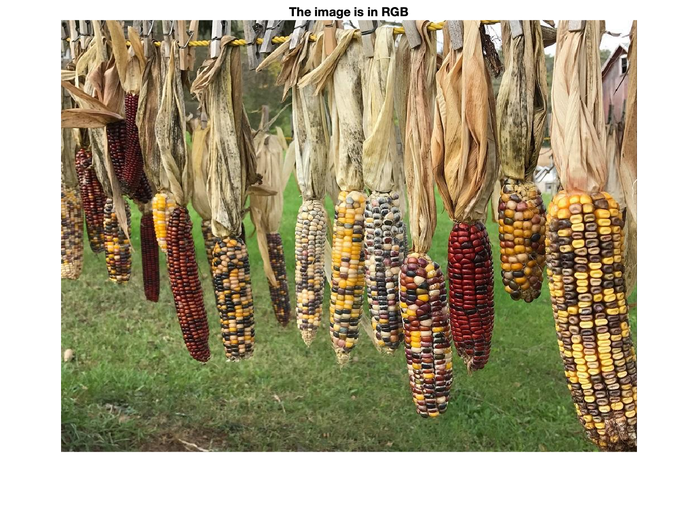
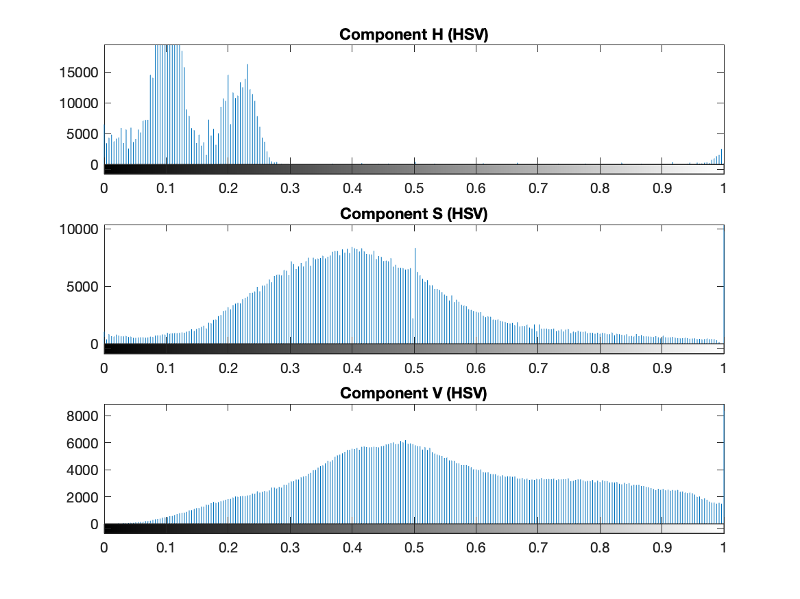
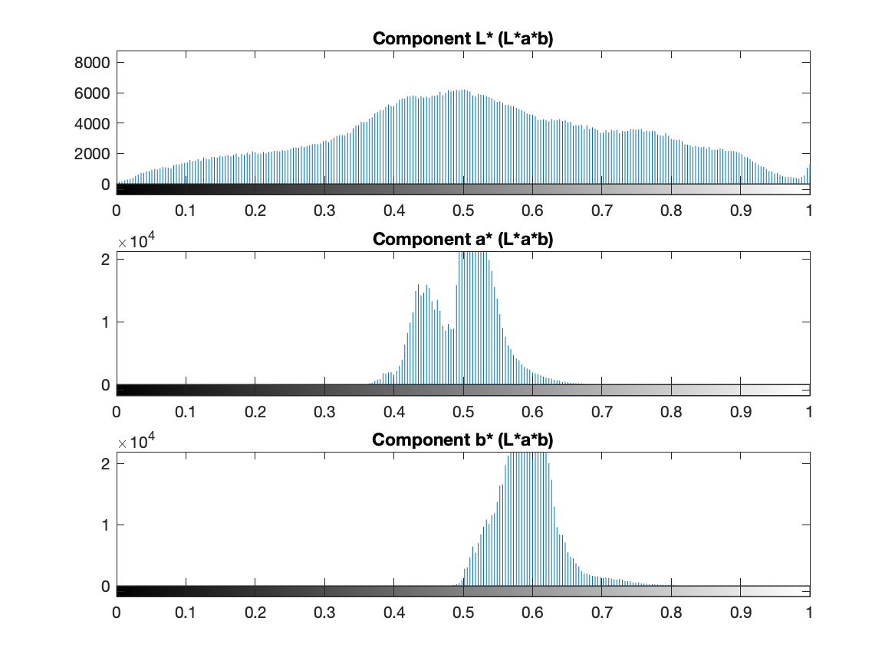

# Lab Assignment 3 - Comparing visual signals

---

- Inês Alexandre Queirós Matos Macedo de Oliveira - 202103343
- Pedro Nuno Ferreira Moura de Macedo - 202007531

---

## Task 1 - Experiments with color histograms for indexing and querying

The purpose of this task is to extract features from visual signals and use these features for comparison, in order to learn some basic techniques that can be used to index and query images. The main goal is to develop a program that returns the most similar images of a main image (passes as a user input to the program).

#### Task 1.1 - Components histograms and single vector

In this subtask, we are expected to convert the images to HSV or L\*a\*b\* colors spaces, separate and plot the three different components of the image and, finally, concatenate the three histograms into one single vector. 

Below it is an example of the image that will be used in this subtask.

    

Now, lets see the different color components histograms of this image.

    
    

In order to analyse this color components correctly, it is necessary to know that how much lighter the image section is, more predominant is the respective color in that area. For example, by looking at the original image and to the separated color components, we can draw some conclusions:

1. **Red Component (R)**: The red component is the darkest of the components, indicating that the red component is the least predominant color in the image. Yet, because the image is not completely dark, this suggests that there are still elements of red through the image (in this case, possibly in the rocks).
2. **Green Component (G)**: The green component is relatively darker overall, which may suggest, as the red component, that there are not a lot trace elements of green in the original image.
3. **Blue Component (B)**: The blue component is bright in regions where the original image is dominantly blue, such as the sky and the ocean. This indicates a high presence of blue in the original image. 
4. **Comparing color components**: By comparing the three color components, it's noticeable that the blue tones are the most predominant in the overall original image.
5. **Component details**: It's noticeable that in the blue components, the light reflection in the water is so strong that resulted in less detail due to the loss of information in the highlights. In contrast, the bigger rocks have more detail because they are less exposed to light than the water.

Now, lets analyse the behaviour of the components in a different color space, the HSV. The _H_ refers to **hue** (angle of the color), _S_ refers to **saturation** (colorfulness of a stimulus relative to its own brightness) and _V_ refers to **value** (attribute of a visual sensation according to which an area appears to emit more or less light).

     
    
    
    

In order to analyse this color components correctly, it is necessary to know that how much lighter the image section is, more predominant is the respective color in that area. For example, by looking at the original image and to the separated color components, we can draw some conclusions:

1. **Hue Component (H)**: This component captures the types of colors present in the original image. Different shades of gray correspond to different colors in the original scene. As we can see in the hue image, the lighter the gray is, the closest the color is to the respective primary color.

2. **Saturation Component (S)**: This component captures the intensity of the colors. Areas that appear brighter in the saturation image are more saturated in the original picture, indicating more vibrant and pure colors. As we can see in the puddle, this one is lighter which may indicate that the blue color is a lot saturated. In contrast, the black sand is darker which may reveal that the color of the sand is further from the respective primary color.

3. **Value Component (V)**: This component represents shows how light or dark the colors in the image are without hue. The lighter areas correspond to brighter regions in the original image, while darker areas represent darker regions (like shadows). For example, the upper part of the sky it's darker than the lower part of the sky (it's possible to see a gray gradient of the value component in the sky).

To get a better insight into the different types of color scales, lets see a different image:

    

Now, lets see the different color components of this image in an rgb color space.

    
    
    

In order to analyse this color components correctly, it is necessary to know that how much lighter the image section is, more predominant is the respective color in that area. For example, by looking at the original image and to the separated color components, we can draw some conclusions:

1. **Red Component (R)**: The red component is noticeably ligher in the biggest closest peppers in the original image, which may suggest that the red is predominat in this pepper.
2. **Green Component (G)**: The same things happens in this component as the red component. In the peppers that are further to the front of the image, the peppers are lighter because they are of the green color.
3. **Blue Component (B)**: The blue component is brighter in the background, because the background color is more approximated to blue than the color of all the peppers.
4. **Comparing color components**: By comparing the three color components, it's noticeable that the image has a lot of different colors. It is also possible to confirm that the blue color is the less present in the orignal image.
5. **Component details**: Because the original picture has a lot of light reflection in all elements, there is a lot of detial in all the elements.

Now, lets analyse the behaviour of the components in a different color space, the HSV. The _H_ refers to **hue** (angle of the color), _S_ refers to **saturation** (colorfulness of a stimulus relative to its own brightness) and _V_ refers to **value** (attribute of a visual sensation according to which an area appears to emit more or less light).

     
    
    
    

In the same way that we analyse the previous picture, let's draw some conclusions about this one:

1. **Hue Component (H)**: As we can see in the hue image, the red pepper is lighter than the yellow peppers because the hue angle of the color red is 0 while the angle of the color green is 120. This resulted in different hues in the image. 

2. **Saturation Component (S)**: As we can see in the red pepper, it's noticeable that the saturation levels on the top of the pepper are more than in the middle part of the pepper.

3. **Value Component (V)**: As we can see in the value image, the garlic in the front of the image is much lighter than the peppers, because it's brighter than the other elements of the image. In contrast, we can see the different gray scales from the pepper above the garlic. The gray tone in the peppers is much gray than the the gralic. 

#### Task 1.2 - Images comparison and vectors distance using different similarity metrics

In this subtask, we are expected to perform a series of operations on images in different color spaces, RGB and YCbCr, using the Matlab properties.
In order to analyse the behaviour of the components in a different color space, the YCbCr. The _Y_ refers to **luminance** or **brightness** (colors increase in brightness as _Y_ increases, also knwown as _luma_), _Cb_ refers to **blue chrominance** (indicates the difference between the blue component and a referenced value) and _Cr_ refers to **red chrominance** (indicates the difference between the red component and a referenced value). The values of _Cb_ can be calculate as follows, `Cb = -0.169 * R - 0.331 * G + 0.500 * B`, which emphasizes the blue color. Similar to this, the _Cr_ can be calculated using the formula, `Cr = 0.500 * R - 0.419 * G - 0.081 * B`, which emphasized the red color. Lets see this in an image.

     

In the above image, we can see that lower values of _Cb_ and _Cr_ are in the lower left corner of this plane, which is where shades of green can be found. 
Below is an example of a normal image with a landscape.

    

Now, lets see the different color components of this image in an rgb color space.

     
    
    
    

By looking at the original image and to the separated color components, we can draw some conclusions:

1. **Luminance (Y)**: By comparing the luminance of the puddle of water and the sand, we notice that the puddle of water is lighter than the sand, which may indicate that the sand is more illuminated than the sand.

2. **Blue chrominance (Cb)**: In the image, we can see the level of blue in relation to the luminace (_Y_) of the image. It represents the amount of blue is present relative to the luminance. In this grayscale image, the areas that appear ligther indicate regions with less blue relative to brightness, and darker areas indicate more blue relative to brightness. For example, in the original image, the sky is a vibrant blue, with a blue gradient. In the _Cb_ component image, the high level of blue (in this case, is in the upper part of the sky) makes the blue chrominace to be high (darker in gray scale). While in the lowest part of the sky, the blue color is not so strong, so it makes the blue chrominance to be lower than the upper part of the sky (lighter in gray scale).

3. **Red chrominance (Cr)**: Similar to the _Cb_ explanation, this chrominance represents the amount of red present relatively to the luminance. In this grayscale image, the areas that appear ligther indicate regions with less red relative to brightness, and darker areas indicate more red relative to brightness. For example, some parts of the rocks (mostly the shadows) have a darker redish color, for the same luminance, which makes the chrominance to be higher in this high red level regions. So, the areas of the rocks that appear to be darker, have the _Cr_ component higher (which makes the gray scale darker).

To get a better insight into the different types of color scales, lets see a different image:

    

Now, lets see the different color components of this image in an YCbCr color space.

     
    
    
    

By looking at the original image and to the separated color components, we can draw some conclusions:

1. **Luminance (Y)**: As said before, the _Y_ component represents the luminance or brigthness of the image. In this image, for example, it's noticeable that the yellow pepper is receving more luminance than the other peppers which makes the peppers to have a more white colors than the other peppers in the _Y_ component image. But, overall, the luminance is almost equal throughout the all image and its components.

2. **Blue chrominance (Cb)**: As also said before, the _Cb_ chrominance refers to the difference between the blue part of the image and the luminance. A darker are means that more blue is present relative to the luminance, and a lighter area means less blue. For example, the blusish background is way ligther than the peppers because it's the only thing close to the blue color in the image. Also, another great example is te yellow pepper. The yellow peppers presents a lot darker in the _Cb_ component image because the yellow color is the opposite of the blue color in the YCbCr color space, as it can be seen below.

    

3. **Red chrominance (Cr)**: Similar to the previous image example, the landscape, the red color will have darker gray regions on the _Cr_ component image. For example, the red peppers almost in the front of the image has a realy light gray region due to the high presence of red in that pepper region. In this case, the cyan color would present the darkest regions of the component image, because its the opposite color of red. It's noticeable that the green peppers are a lot darker than the rest of the peppers, due to the fact that the primary colors that are closest to the cyan color are the green and blue, which makes the green and the blue colors in this component a lot gray ligther than the other elements of the image.

#### Task 1.3 - Top_k similar images of a specific image

In this subtask, we are expected to perform a series of operations on images in different color spaces, RGB and L\*a\*b\*, using the Matlab properties.

In order to analyse the behaviour of the components in a different color space, the L\*a\*b\*. The _L_ refers to **lightness** (represented on a vertical axis with values from 0, black, to 100, white), _a\*_ refers to **red/green value** (the negative axis is green and the positive axis is red) and _b\*_ refers to **blue/yellow value** (the negative axis is blue and the positive axis is yellow). 

    

In order to understand the L\*a\*b\* color space, lets see it in an image.

    

Now, lets see the different color components of this image in an L\*a\*b\* color space.

     
    
    
    

1. **Lightness (L\*)**: Almost all of the elemnts in the original image are very lightned, so in the _L_ image it will appear almost all white (due to the high presence of light in the original image). It's also noticeable that some elements of the original image got darker in the _L_ component. For example, the rocks on the sand present a grayer tone due to the fact that has less light than the other elements (the rocks have shadows). Because the most predominant color in the original image is blue (which is neutral in the _a_ component), this component may not be as much contrast as the _b_ component in this particular image. Still, it's a little noticeable the presence of the red color in the bigger rocks (because they are darker in the _a_ component graph), which may indicate a strong presence of the color red in the bigger rocks.

2. **Red/Green value (a\*)**: Negative values indicate green while positive values indicate red. In the _a_ component image, areas that appear darker might indicate a strog presence of green, and areas that appear lighter may indicate a strong presence of red. 

3. **Yellow/Blue value (b\*)**: Negative values indicate blue while positive values indicate yellow. In the _b_ component image, areas that appear darker might indicate a strog presence of blue, and areas that appear ligther may indicate a strong presence of yellow. In the original image, the predominant color is blue, which may be confirmed by looking at the _b_ component. For example, the sky and the puddle of water are a lot darker than the other elements (as the rocks), which indicates that they have a strong presence of the blue color (which can be confirmed in the original image).

To get a better insight into this type of color scale, _YCbCr_, lets see a different image:

    

Now, lets see the different color components of this image in an YCbCr color space.

     
    
    
    

By looking at the original image and to the separated color components, we can draw some conclusions:

1. **Lightness (L\*)**: The _L_ component image is almost entirely white, which may indicate that the majority of the original image has high luminance. This correlates with the original image being bright and have vibrant colors, which suggest that the original image is well lit with few dark shadows.

2. **Red/Green value (a\*)**: In the _a_ component image shows significant darker areas, suggesting that there are regios with a stronger green presence, while others are ligther which may indicate a strong red presence. For example, the different color peppers have significant color constrasts in this components. The red pepper is ligther while the green peppers are darker.

3. **Yellow/Blue value (b\*)**: In the _b_ component image shows significant contrast between the background and the peppers. In this component, the darker areas represent a strong presence of blue, while ligther areas represent a strong presence of yellow. The _b_ component image can confirm this assumption since the only element that is darker is the background (which has a color near to the blue primary color), while all of the peppers are white in this component (which indicates a low presence of blue in this elements).

#### Task 1.4 - Algorithms performace evaluation

In this subtask, we are expected to compute the color histograms of the images in two different color spaces, RGB and L\*a\*b\*.

Starting with the landscape images.

    
    
    

The RGB histogram is:

     

In order to interpret this histogram is important to know that the x-axis represents the gray scale (the lowest value represents the black color, and the highest possible value represents the white color). From this histogram and this explanation, we can draw some conclusions:

1. **Red Channel**: The peak in lower values indicates a significant presence of darker red tones, which could be shadows or darker objects in the original image.
2. **Green Channel**: The more even distribution, with multiple peaks, suggests a variety of green tones, indicating a balanced presence of light and dark green tones.
3. **Blue Channel**: The peaks at the lower and very high ends suggests both deep blues (likely the sky or water) and very blues, which might correspond to highlights or reflections. Because the original image is mostly blue, this component will have a lot of white sections in the component image.

The L\*a\*b\* histogram is:

    

1. **L\* Channel (Luminance)**: The broad distribution of the peaks throughout the histogram, but rather in the middle of the histogram suggests that while there are bright areas in the original image, the majority of the image consists of midtones, and the image has well balanced between light and dark areas.
2. **a\* Channel (Red/Green value)**: In this component, it's possible to confirm that there are more peaks in the positive axis than in the negative axis. This means that in the original image there is more present the red color than the green color. This can be confirmed just by looking to the _a_ component image, by checking that there are more light areas (less dark areas represent more tons of red).
3. **b\* Channel (Yellow/Blue value)**: In this component, it's possible to notice that there are way more peaks in the negative axis than in the positive axis. This could mean that there are more areas near the blue color than the yellow color. This can be true since the image that is being analysed has a lot of blue tones. Also, in the _b\*_ component image is possible to notice that is almost entirely black which, as said previously, mean thatv there are more tones of blue than yellow.

To get a better insight into this two types of color scale, _RGB_ and _L\*a\*b\*_, lets see the RGB histogram of a different image (peppers image):

    

From this histogram and the previous explanation about how to interpret histograms, we can draw some conclusions:

1. **Red Channel**: In the histogram we can see that there are a lot of mid-tones of red, indicating a moderate presence of red values in the image. There is also a significant presence at the highest end of the scale, which corresponds to an area where the color red is predominant (this high peak in the end of the histogram must be from all of the red peppers in the image).

2. **Green Channel**: In this histogram is possible to notice that the peaks are more centered with a good distribution around the mid-tones. This implies a balanced presence of green values in the image (this color is most present in the peppers).

3. **Blue Channel**: In the histogram of this component, the blue color of the background is not so strong as the blue primary color, which we can confirm by looking to the peaks that are located mostly on the start of the x-axis.

The L\*a\*b\* histogram of this image (peppers image) is:

    

1. **L\* Channel (Luminance)**: The component _L_ image is very bright, indicating the entire image has very high luminance, suggesting that the image is well lit. The peak that can be seen in the middle part of the histogram can suggest that the image has a good amount of midtone luminance.

2. **a\* Channel (Red/Green value)**: In this component, it's possible to see a central peak around 20 value, indicating that the image has slightly more pixels falling on the positive side, which means a slight dominance of the red color tones over the green color tones. 

3. **b\* Channel (Yellow/Blue value)**: In this component, it's possible to notice a high peak between the range [-20,0] and way more peaks in the negative axis rather than the positive axis. This may suggest that there is a big dominance of the blue color tones than the yellow color tones (this can be confirmed by looking at the darker part of the b\* image component - the dark area represents the approximately the blue color, while the rest of the image is almost all white - parts of the image that are not even closr to the blue primary color).

## Task 2 - Experiments with SIFT for indexing and querying

The purpose of this task is to use the enlarge/reduce a predefined image _imzoneplate_, that is generated by executing a pre-given file, _imzoneplate.m_.
It is also asked to test the program with different dimensions for the zoneplate image and to use different interpolation methods of the built-in function _imresize.m_ file. 
For the purpose of this task, we will due for three different dimensions (64, 128 and 256 pixeis) and for each of them all of the possible interpolation methods (_bicubic_, _bilinear_, _box_, _cubic_, _lanczos2_, _lanczos3_, _nearest_ and _triangle_).
Let's start by cehcking the results obtained using different dimensions for the zoneplate image.

## Conclusion

The **qunatisation process** refers to the process of constraining an input from a large set to output in a smaller set. This process evolves reducing the number of bits needed to store the color of each pixel.
The **dithering technique** is a technique that can be used to make a lower bit-depth blend colors by introducing random noise to the image n strategic locations. 

    <figure>
        
        <figcaption><strong>Dithering</strong> technique example</figcaption>
    </figure>

The **dithering technique** is useful because it reduces the effects of pixel-to-pixel errors in the flat field, and helps to remove quantisation distortion that occurs when reducing the number of bits. This technique creates an illusion of richer color depth n images with a reduced color palette.
The **filtering process** is the process of manipulating images to improve the qualilty of the image and suppress unwanted noise. There are a vast amount of filter types and options to choose depending on the requirements. Effective filtering improves image quality for better interpretation, but it's important to measure the values of the paramters since they can also introduce errors (and noise) in the result image.

## Annexes

#### Annex A: Experiments with colors spaces

###### Annex A.1: RGB and HSV components (ex1)

- *elephant.bmp* file:

    

    <figure>
    
    <figcaption>Elephant.bmp file in grayscale image</figcaption>
    </figure>
    

- *floresVermelhas.bmp* file:

    

    
    

    

    
    

    

    
    

    

    
    

    

    
    

    

    
    

    

    
    

    

    
    

    

    
    

- *folhasVerdes.bmp* file:

    

    
    

    

    
    

    

    
    

    

    
    

    

    
    

    

    
    

    

    
    

    

    
    

    

    
    

- *lighthouse.png* file:

    

    
    

    

    
    

    

    
    

    

    
    

    

    
    

    

    
    

    

    
    

    

    
    

    

    
    

- *peppers.png* file:

    

    
    

    

    
    

    

    
    

    

    
    

    

    
    

    

    
    

    

    
    

    

    
    

    

    
    

- *praia.bmp* file:

    

    
    

    

    
    

    

    
    

    

    
    

    

    
    

    

    
    

    

    
    

    

    
    

    

    
    

###### Annex A.2: RGB and YCbCr components (ex2)

- *elephant.bmp* file:

    

    <figure>
    
    <figcaption>Elephant.bmp file in grayscale image</figcaption>
    </figure>
    

- *floresVermelhas.bmp* file:

    

    
    

    

    
    

    

    
    

    

    
    

    

    
    

    

    
    

    

    
    

    

    
    

    

    
    

- *folhasVerdes.bmp* file:

    

    
    

    

    
    

    

    
    

    

    
    

    

    
    

    

    
    

    

    
    

    

    
    

    

    
    

- *lighthouse.png* file:

    

    
    

    

    
    

    

    
    

    

    
    

    

    
    

    

    
    

    

    
    

    

    
    

    

    
    

- *peppers.png* file:

    

    
    

    

    
    

    

    
    

    

    
    

    

    
    

    

    
    

    

    
    

    

    
    

    

    
    

- *praia.bmp* file:

    

    
    

    

    
    

    

    
    

    

    
    

    

    
    

    

    
    

    

    
    

    

    
    

    

    
    

###### Annex A.3: RGB and L\*a\*b\* components (ex3)

- *elephant.bmp* file:

    

    <figure>
    
    <figcaption>Elephant.bmp file in grayscale image</figcaption>
    </figure>
    

- *floresVermelhas.bmp* file:

    

    
    

    

    
    

    

    
    

    

    
    

    

    
    

    

    
    

    

    
    

    

    
    

    

    
    

- *folhasVerdes.bmp* file:

    

    
    

    

    
    

    

    
    

    

    
    

    

    
    

    

    
    

    

    
    

    

    
    

    

    
    

- *lighthouse.png* file:

    

    
    

    

    
    

    

    
    

    

    
    

    

    
    

    

    
    

    

    
    

    

    
    

    

    
    

- *peppers.png* file:

    

    
    

    

    
    

    

    
    

    

    
    

    

    
    

    

    
    

    

    
    

    

    
    

    

    
    

- *praia.bmp* file:

    

    
    

    

    
    

    

    
    

    

    
    

    

    
    

    

    
    

    

    
    

    

    
    

    

    
    

###### Annex A.4: Color histogram in the different color spaces (ex4)

- *elephant.bmp* file:

    

    
    

- *floresVermelhas.bmp* file:

    

    
    

- *folhasVerdes.bmp* file:

    

    
    

- *lighthouse.png* file:

    

    
    

- *peppers.png* file:

    

    
    

- *praia.bmp* file:

    

    
    

#### Annex B: Variation of image spatial dimensions using or not filters with the “imzoneplate” test image

###### Annex B.1: Size of 64

- Bicubic method

    

    
    

    

    
    

    

    
    

    

    
    

    

    
    

    

    
    

    

    
    

- Bilinear method

    

    
    

    

    
    

    

    
    

    

    
    

    

    
    

    

    
    

    

    
    

- Box method

    

    
    

    

    
    

    

    
    

    

    
    

    

    
    

    

    
    

    

    
    

- Cubic method

    

    
    

    

    
    

    

    
    

    

    
    

    

    
    

    

    
    

    

    
    

- Lanczos2 method

    

    
    

    

    
    

    

    
    

    

    
    

    

    
    

    

    
    

    

    
    

- Lanczos3 method

    

    
    

    

    
    

    

    
    

    

    
    

    

    
    

    

    
    

    

    
    

- Nearest method

    

    
    

    

    
    

    

    
    

    

    
    

    

    
    

    

    
    

    

    
    

- Triangle method

    

    
    

    

    
    

    

    
    

    

    
    

    

    
    

    

    
    

    

    
    

###### Annex B.2: Size of 128

- Bicubic method

    

    
    

    

    
    

    

    
    

    

    
    

    

    
    

    

    
    

    

    
    

- Bilinear method

    

    
    

    

    
    

    

    
    

    

    
    

    

    
    

    

    
    

    

    
    

- Box method

    

    
    

    

    
    

    

    
    

    

    
    

    

    
    

    

    
    

    

    
    

- Cubic method

    

    
    

    

    
    

    

    
    

    

    
    

    

    
    

    

    
    

    

    
    

- Lanczos2 method

    

    
    

    

    
    

    

    
    

    

    
    

    

    
    

    

    
    

    

    
    

- Lanczos3 method

    

    
    

    

    
    

    

    
    

    

    
    

    

    
    

    

    
    

    

    
    

- Nearest method

    

    
    

    

    
    

    

    
    

    

    
    

    

    
    

    

    
    

    

    
    

- Triangle method

    

    
    

    

    
    

    

    
    

    

    
    

    

    
    

    

    
    

    

    
    

###### Annex B.3: Size of 256

- Bicubic method

    

    
    

    

    
    

    

    
    

    

    
    

    

    
    

    

    
    

    

    
    

- Bilinear method

    

    
    

    

    
    

    

    
    

    

    
    

    

    
    

    

    
    

    

    
    

- Box method

    

    
    

    

    
    

    

    
    

    

    
    

    

    
    

    

    
    

    

    
    

- Cubic method

    

    
    

    

    
    

    

    
    

    

    
    

    

    
    

    

    
    

    

    
    

- Lanczos2 method

    

    
    

    

    
    

    

    
    

    

    
    

    

    
    

    

    
    

    

    
    

- Lanczos3 method

    

    
    

    

    
    

    

    
    

    

    
    

    

    
    

    

    
    

    

    
    

- Nearest method

    

    
    

    

    
    

    

    
    

    

    
    

    

    
    

    

    
    

    

    
    

- Triangle method

    

    
    

    

    
    

    

    
    

    

    
    

    

    
    

    

    
    

    

    
    

###### Annex B.4: Size of 512

- Bicubic method

    

    
    

    

    
    

    

    
    

    

    
    

    

    
    

    

    
    

    

    
    

- Bilinear method

    

    
    

    

    
    

    

    
    

    

    
    

    

    
    

    

    
    

    

    
    

- Box method

    

    
    

    

    
    

    

    
    

    

    
    

    

    
    

    

    
    

    

    
    

- Cubic method

    

    
    

    

    
    

    

    
    

    

    
    

    

    
    

    

    
    

    

    
    

- Lanczos2 method

    

    
    

    

    
    

    

    
    

    

    
    

    

    
    

    

    
    

    

    
    

- Lanczos3 method

    

    
    

    

    
    

    

    
    

    

    
    

    

    
    

    

    
    

    

    
    

- Nearest method

    

    
    

    

    
    

    

    
    

    

    
    

    

    
    

    

    
    

    

    
    

- Triangle method

    

    
    

    

    
    

    

    
    

    

    
    

    

    
    

    

    
    

    

    
    

#### Annex C: Filtering experiences

###### Annex C.1: Average filter

###### Annex C.2: Disk filter

###### Annex C.3: Gaussian filter

###### Annex C.4: Laplacian filter

###### Annex C.5: Log filter

###### Annex C.6: Motion filter

###### Annex C.7: Prewitt filter

###### Annex C.8: Sobel filter

