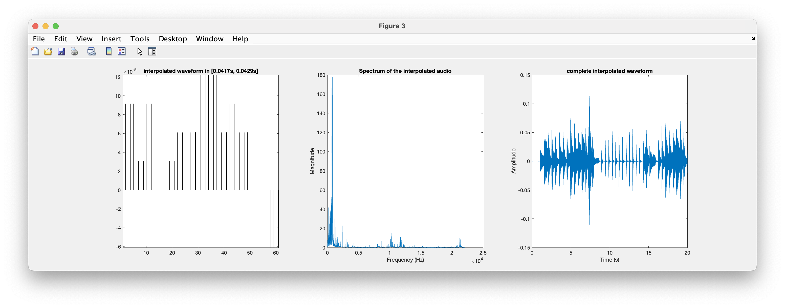

# Lab Assignment 1 - Sampling and Quantisation of media signals

## Task 1 - (Optional) Introductory part that may be developed outside the classroom

After applying the different sampling rates to the same audio file (in this case, we used the _audioCluck.wav_ file), we got 3 files (the original file - _audioCluck.wav_, another file with 11025 Hz of sampling rate - _audioCluck2.wav_, and another file with 44100 Hz of sampling rate - _audioCluck3.wav_). 

After carefully analysing the 3 audio files, we got to these conclusions:

1. The audio files _audioCluck.wav_ and _audioCluck3.wav_ were both sampled at 44100 Hz of sampling rate, while _audioCluck2.wav_ was sampled at 11025 Hz of sampling rate. The lower sampling rate of _audioCluck2.wav_ is noticeable in the audio quality compared to the other two files, since it exhibits less clarity.

## Task 2 - Variation of sampling frequency with or without filters

1. After executing the command `amostragemInterp_semFiltro("./resources/audios/California20sec.wav","./outputFiles/outputCalifornia20sec.wav",4)`, we got the following output: 
<br />

    ```md
    Importar o som original

    Carregue numa tecla para continuar

    O som sub-amostrado

    Carregue numa tecla para continuar

    O som interpolado

    Carregue numa tecla para continuar

    Erro entre o sinal original e o interpolado = 5.66584e-06


    PSNR do sinal interpolado = 33.7013
    ```

    This were the graphics of the 3 types of waves (original, subsampled and interpolated).

    

    

    

2. Comparing the original sound _Mozart20sec.wav_ with the interpolated sound _Mozart20sec\_interpolated\_without\_filter\_factor\_4.wav_, the interpolated audio exhibits increased harshness due to the sub-sampling and interpolating process. 
The perceptual quality can be measured with two properties: __loudness__ (used to quantify the sound intensity) and __pitch__ (used to quantify the sound tonality). Hearing both of the audios, we can notice that the second audio (the audio result of the interpolation process) has more noise than the original audio, and it also seems louder than the original audio event if when the volume was at the same level during the testing phase of both audios. 
By analysing the formula to calculate the magnitude of a wave using its amplitude, `x(t) = A * cos(w * t)`, for the same `cos(w * t)`value, we can conclude that if the magnitute increases, `x(t)`, the amplitude of the wave, `A` will also increase. Because in the interpolated audio, the amplitude interval decreased from [0, ≈525] to [0, ≈180], we can say that the interpolated wave has a high rate of variation in time (frequency), because for small variation in amplitude, there is a high rate of variation in time (frequency). So, we can conclude that the interpolated audio increased in terms of __pitch__ (higher frequency means higher __pitch__). For the __loudness__ parameter, it depends a lot on the person is listening, but the interpolated sound appears to sound louder than the original sound, and it also presents lower amplitude than the original sound.
Comparing the waveform of the original wave and the interpolated wave, **<END THIS PLEASE\ !!!!!!>**.
As we can see from the results obtained, we can see that the Mean Square Error (MSE) is 0.000158208. Because the MSE is relatively low, we can conclude that the difference between the original sound and the interpolated sound is small, which generally indicates that the interpolation process was done successfully.
Now moving on to the second part of the problem. We are going to apply the interpolation but this time with a factor of 2 instead of 4. 

    After executing the command `amostragemInterp_semFiltro("./resources/audios/Mozart20sec.wav","./outputFiles/Mozart/Mozart20sec_interpolated_without_filter_factor_2.wav",2)`, we got the following output: 
    <br />

    ```md
    Importar o som original

    Carregue numa tecla para continuar

    O som sub-amostrado

    Carregue numa tecla para continuar

    O som interpolado

    Carregue numa tecla para continuar

    Erro entre o sinal original e o interpolado = 8.17638e-07


    PSNR do sinal interpolado = 42.1083
    ```

    This were the graphics of the 3 types of waves (original, subsampled and interpolated).

    
    <p style="text-align:center">Original wave results</p>

    
    <p style="text-align:center">Subsampled wave results</p>

    
    <p style="text-align:center">Interpolated wave results</p>
    
    <p style="margin-bottom: 100px"></p>

    Comparing the original sound _Mozart20sec.wav_ with the interpolated sound _Mozart20sec\_interpolated\_without\_filter\_factor\_2.wav_, in terms of perceptual quality, the differences are not so much, almost none, as the previous one.


    When comparing both of the approaches (with 2 and 4 of factor), we can come to some conclusions:
    
    1. 


3. Asnwer over here ...
<br />

    ```md
    Importar o sinal original para a variavel y

    frequencia de amostragem = 44100 ; numero de amostras = 882000
    Numero original de amostras no sinal de entrada = 882000


    Prima uma tecla para continuar

    O som sub-amostrado 

    Prima uma tecla para continuar

    O pre-filtro utilizado 

    Prima uma tecla para continuar

    O som interpolado 

    Prima uma tecla para continuar

    O filtro utilizado na interpolacao 

    Prima uma tecla para continuar

    Erro entre o sinal original e o interpolado = 0.000158208


    PSNR do sinal interpolado = 29.8788
    ```