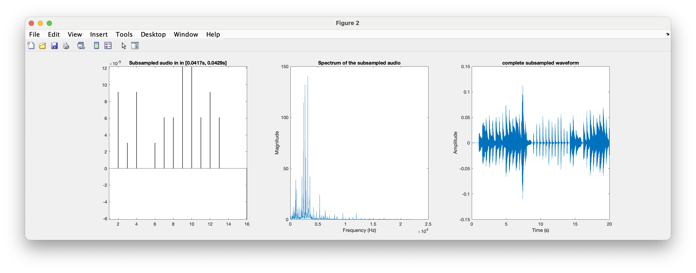
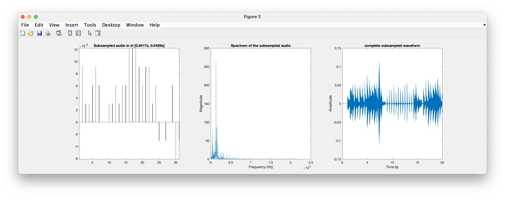
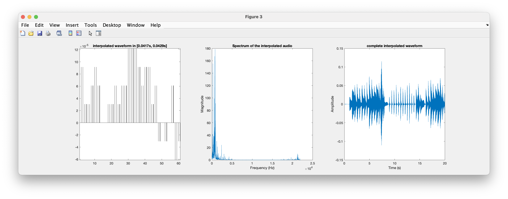

# Lab Assignment 1 - Sampling and Quantisation of media signals

---

- Inês Alexandre Queirós Matos Macedo de Oliveira - 202103343
- Pedro Nuno Ferreira Moura de Macedo - 202007531

---

## Task 1 - (Optional) Introductory part that may be developed outside the classroom

After applying the different sampling rates to the same audio file (in this case, we used the _audioCluck.wav_ file), we got 3 files (the original file - _audioCluck.wav_, another file with 11025 Hz of sampling rate - _audioCluck2.wav_, and another file with 44100 Hz of sampling rate - _audioCluck3.wav_). 

After carefully analysing the 3 audio files, we got to these conclusions:

1. The audio files _audioCluck.wav_ and _audioCluck3.wav_ were both sampled at 44100 Hz of sampling rate, while _audioCluck2.wav_ was sampled at 11025 Hz of sampling rate. The lower sampling rate of _audioCluck2.wav_ is noticeable in the audio quality compared to the other two files, since it exhibits less clarity.

## Task 2 - Variation of sampling frequency with or without filters

1. After executing the command `amostragemInterp_semFiltro("./resources/audios/Mozart20sec.wav","./outputFiles/Mozart20sec/without_filter/outputMozart20sec_factor_4.wav",4)`, we got the following output: 
<br />

```md
>> amostragemInterp_semFiltro("./resources/audios/Mozart20sec.wav","./outputFiles/Mozart20sec/without_filter/outputMozart20sec_factor_4.wav",4)

Importing the original audio

info = 

struct with fields:

        Filename: '/Users/pedromacedo/Desktop/Desktop - MacBook Air de Pedro/Study/Year 4/Semester2/SAM-Year4Semester2/Project/source/resources/audios/Mozart20sec.wav'
CompressionMethod: 'Uncompressed'
    NumChannels: 1
    SampleRate: 44100
    TotalSamples: 882000
        Duration: 20
            Title: []
        Comment: []
        Artist: []
    BitsPerSample: 16


the number of samples in the original audio: 
N = 882000


Press a key to continue

The subsampled audio

the number of samples in the subsampled audio: 
ans = 220500


Carregue numa tecla para continuar

The interpolated sound

the number of samples in the interpolated audio: 
ans = 882000


Carregue numa tecla para continuar

Erro entre o sinal original e o interpolado = 5.66584e-06


PSNR do sinal interpolado = 33.7013
```

This were the graphics of the 3 types of waves (original, subsampled and interpolated):


<p style="text-align:center">Original wave graphs</p>


<p style="text-align:center">Subsample wave results</p>


<p style="text-align:center">Interpolated wave results</p>

2. **Comparison of the original sound and the processed sounds in terms of perceptual quality, waveform and spectrum**

    - **Factor of 4 (k = 4)**: Comparing the original sound _Mozart20sec.wav_ with the interpolated sound _outputMozart20sec\_factor\_4.wav_ (the file inside the directory `/outputFiles/Mozart20sex/without_filter` directory), we can notice some differences:

        
        <p style="text-align:center">Original wave results</p>

        
        <p style="text-align:center">Subsampled wave results</p>

        
        <p style="text-align:center">Interpolated wave results</p>
    
        1. _Perceptual quality_: The perceptual quality can be measured with two properties: __loudness__ (used to quantify the sound intensity) and __pitch__ (used to quantify the sound tonality). Hearing both of the audios, we can notice that the second audio (the audio result of the interpolation process) has more noise than the original audio, and it also seems louder than the original audio even when the audio volume was the same during the testing phase. 
        By analysing the formula to calculate the magnitude of a wave using its amplitude, `x(t) = A * cos(w * t)`, for the same `cos(w * t)`value, we can conclude that if the magnitute increases, `x(t)`, the amplitude of the wave, `A`, will also increase. Because in the interpolated audio, the amplitude interval decreased from [0, ≈525] to [0, ≈180], we can confirm that the interpolated wave has a high rate of variation in time (frequency), because for small variation in amplitude, there is a high rate of variation in time (frequency). So, we can conclude that the interpolated audio increased in terms of __pitch__ (higher frequency means higher __pitch__). For the __loudness__ parameter, it depends a lot on the person is listening, but the interpolated sound appears to sound louder than the original sound, and it also presents lower amplitude than the original sound. To conclude, comparing the original and the interpolate sounds, we could realize that the audio became more harsh.
        2. _Waveform_: Looking to the sound waves (the original, the subsampled and the interpolated), we can see that the original waveform show the most detail, while the subsampled show less detail due to the reduced data points. Since the interpolated form as more data points, it shows a smoother version of the original waveform, potentially, missing some of the finer details. Additionally, we can notice that the y-axis range in the interpolated waveform is bigger than the one in the original waveform. This can be due to the interpolation process which could have affected the dynamic range of the audio signal. Because the range is higher, the "quiet" parts might be quieter, and the "loud" parts might be louder than the original sound. By listening to the audio, we could confirm that the lower parts are lower and the higher parts are louder in the interpolated sound. 
        3. _Spectrum_: We can see that after subsampling the original audio, the range of magnitude decreased. This can happen bacause of the reduction of the number of samples (by specifying a number for the _k_ parameter). For example, in this case, `k = 4`, when applying the subsample process, only one sample will be selected to be part of the subsample, so this could lead to data loss. Following this, we verified that by applying the interpolation process to this subsample, we are trying to approximate the subsample sound/waveform to the original sound/waveform.
        
    
    - **Factor of 2 (k = 2)**: Now moving on to the second part of the problem. We are going to apply the interpolation but this time with a factor of 2 instead of 4. 

        After executing the command `amostragemInterp_semFiltro("./resources/audios/Mozart20sec.wav","./outputFiles/Mozart20sec/without_filter/outputMozart20sec_factor_2.wav",2)`, we got the following output: 
        <br />

        ```md
        >> amostragemInterp_semFiltro("./resources/audios/Mozart20sec.wav","./outputFiles/Mozart/Mozart20sec_interpolated_without_filter_factor_2.wav",2)

        Importing the original audio

        info = 

        struct with fields:

                Filename: '/Users/pedromacedo/Desktop/Desktop - MacBook Air de Pedro/Study/Year 4/Semester2/SAM-Year4Semester2/Project/source/resources/audios/Mozart20sec.wav'
        CompressionMethod: 'Uncompressed'
            NumChannels: 1
            SampleRate: 44100
            TotalSamples: 882000
                Duration: 20
                    Title: []
                Comment: []
                Artist: []
            BitsPerSample: 16


        the number of samples in the original audio: 
        N = 882000


        Press a key to continue

        The subsampled audio

        the number of samples in the subsampled audio: 
        ans = 441000


        Carregue numa tecla para continuar

        The interpolated sound

        the number of samples in the interpolated audio: 
        ans = 882000


        Carregue numa tecla para continuar

        Erro entre o sinal original e o interpolado = 8.17638e-07


        PSNR do sinal interpolado = 42.1083
        ```

        This were the graphics of the 3 types of waves (original, subsampled and interpolated).

        
        <p style="text-align:center">Original wave results</p>

        
        <p style="text-align:center">Subsampled wave results</p>

        
        <p style="text-align:center">Interpolated wave results</p>
        
        <p style="margin-bottom: 100px"></p>

        Comparing the three diferent types of results (the original, the subsampled and the interpolated wave results), we can see that the differences are similar to the ones mention in the previous experience (no filter and a factor of 4).

        1. _Perceptual quality_: By earing both of the original audio and the interpolated audio with a factor of 2, we can notice that there is no much of the differences to the original audio, that are noticeable in a human earing. 
        2. _Waveform_: Looking to the sound waves (the original, the subsampled and the interpolated), we can see that the subsampled waveform shows less detail due to the fact that has less data points to compute the sound wave (60 / 2 = 30 data points). To recover data loss, we used the interpolation process. After applying it, we can see that the interpolated process has 60 data points, which the lost data points that were recreated in this processs are a good approximiation to the ones in the original waveform. 
        3. _Spectrum_: We can see that after subsampling the original audio, the range of magnitude decreased. This situation is similar to what happened in the soundwave with no filters and a factor of 4. 

    - **Comparison between the two factors, 2 and 4**: When comparing both of the approaches (with 2 and 4 of factor), some conclusions were pointed:
        1. _Sample data loss_: We can see, both in the interpolated waveforms and in the graphics representing the the wave with filters and factors of 2 and 4, that the graphic with factor of 4 had more sample data loss than the one with factor of 2. This happens because with a bigger factor, less samples are selected in the subsampling process, which will cause less information for the interpolation process to work on. A factor of 4 means that from 4 samples of the original waveform, only 1 will enter in the subsample, while with a factor of 2 means that from 2 samples of the original waveform, only 1 will enter in the subsample.
        2. _Magnitudes_: In the situation with a factor of 2, there were no reports of magnitudes in the frequencies between 1Hz and 1.5Hz. This can happens to similar reasons referenced in the previous point. Due to the loss of samples due to the high factor, this could had lead to a loss of high-frequency content, and would probably introduce aliasing.
        3. _Mean Square Error (MSE)_: The _MSE_ is a mesaure of an estimator. It is often used to quantify the amount of error between a reference signal and the interpolated signal. The _PSNR_ (_Peak signal-to-noise Ratio_) is used to measure the quality of the reconstruction of samples lost during the subsampled process.
        As we can see from the results obtained, the Mean Square Error (MSE) is 5.66584e-06 for a factor of 2, and 8.17638e-7 for a factor of 4. For the sample with factor of 4, because the MSE is relatively low, we can conclude that the difference between the original sound and the interpolated sound wiht factor of 4 is small, which generally indicates that the interpolation process was done successfully.
    
            | Factor       |      MSE     |    PSNR   |
            | -----------  | ------------ | --------- |
            | k = 2        |  5.66584e-6  |  33.7013  |
            | k = 4        |  8.17638e-7  |  42.1083  |

3. **Interpolation with filters and two different factors, 2 and 4**

    - For `k = 2`, the results obtained were the following ones:

        ```md
        >> amostragemInterp_comFiltro("./resources/audios/Mozart20sec.wav","./outputFiles/Mozart20sec/with_filter/outputMozart20sec_factor_2.wav",2)

        Importar o sinal original para a variavel y 

        frequencia de amostragem = 44100 ; numero de amostras = 882000
        Numero original de amostras no sinal de entrada = 882000


        Prima uma tecla para continuar

        O som sub-amostrado 

        Prima uma tecla para continuar

        O pre-filtro utilizado 

        Prima uma tecla para continuar

        O som interpolado 

        Prima uma tecla para continuar

        O filtro utilizado na interpolacao 

        Prima uma tecla para continuar

        Erro entre o sinal original e o interpolado = 4.55849e-10


        PSNR do sinal interpolado = 74.6457
        ```

        1. _Perceptual quality_: By earing both of the original audio and the interpolated audio with filters and a factor of 2, we can't really not notice much differences, at least that are noticeable in a human earing, between the audios. 
        2. _Waveform_: Looking to the sound waves (the original, the subsampled and the interpolated), we can see that the interpolated graph is really similar to the original sound waveform. This could happen because of the inplementation of filters in the interpolation process.
        3. _Spectrum_: In the interpolated graph, we can see that there are now suddently high peaks as the the subsampled graphic.

    - And, for `k = 4`, the results obtained were the following ones:

        ```md
        >> amostragemInterp_comFiltro("./resources/audios/Mozart20sec.wav","./outputFiles/Mozart20sec/with_filter/outputMozart20sec_factor_4.wav",4)

        Importar o sinal original para a variavel y 

        frequencia de amostragem = 44100 ; numero de amostras = 882000
        Numero original de amostras no sinal de entrada = 882000


        Prima uma tecla para continuar

        O som sub-amostrado 

        Prima uma tecla para continuar

        O pre-filtro utilizado 

        Prima uma tecla para continuar

        O som interpolado 

        Prima uma tecla para continuar

        O filtro utilizado na interpolacao 

        Prima uma tecla para continuar

        Erro entre o sinal original e o interpolado = 3.00164e-09


        PSNR do sinal interpolado = 66.4603
        ```

        1. _Perceptual quality_: By earing both of the original audio and the interpolated audio with filters and a factor of 2, we can't really not notice much differences, at least that are noticeable in a human earing, between the audios. 
        2. _Waveform_: Looking to the sound waves (the original, the subsampled and the interpolated), we can see that the interpolated graph is really similar to the original sound waveform. This could happen because of the implementation of filters in the interpolation process.
        3. _Spectrum_: In the interpolated graph, we can see that there are now suddently high peaks as the the subsampled graphic.
    
    - **Comparison between the two factors, 2 and 4, with filters**: By comparing the results obtained from both the experiences with filters, we can see some differences:

        1. _Sample data loss_: This case is similar to the the observations pointed out in the previous experience, experiences without filters with factor of 2 and 4. Actually, as we can see in the graphic obtained in the experience with filters and a factor of 2, we see that this graph is closer to the original wave form than the one generated by the graph with filters and a factor of 4. This can be justified by the fact that the subsampling with a factor of 4 has less data points (less information available) than the subsampling with a factor of 2.
        2. _Magnitudes_: In the situation with a factor of 2, the magnitudes in each sample were closer to the original sound samples frequencies than the ones registered in the experience with filters and a factor of 4.
        3. _Mean Square Error (MSE)_: As we can see from the results obtained, the Mean Square Error (MSE) is 4.55849e-10 for a factor of 2, and 3.00164e-9 for a factor of 4. For the sample with factor of 4, because the MSE is relatively low, we can conclude that the difference between the original sound and the interpolated sound with a factor of 4 is small, which generally indicates that the interpolation process was done successfully. Similar to what happened in the previous experience (the experience without filters and with both factors, 2 and 4), the case with filters and a factor of 2 has lower error rate and a higher PSNR when compared to the case with filters and a factor of 4. This means that the case with filters and a factor of 2 is more accurate than the case with filters and a factor of 4 to predicte and approximate the sound wave to the original sound.
    
            | Factor       |      MSE      |    PSNR   |
            | -----------  | ------------- | --------- |
            | k = 2        |  4.55849e-10  |  74.6457  |
            | k = 4        |  3.00164e-9   |  66.4603  |
        
    - **Comparison between the two programs**: By comparing the results obtained from both the programs (the first one which the filters were not use, and the last one which the filters were applied), we can confirm that from the 4 experiences made (2 without filters and 2 with filters), the one that lead to better results for the same value of _k_ was the experience with filters and a factor of 2. This experience registered, as we can see in the last topic table, the highest _PSNR_ (74.6457) and the lowest _MSE_/error rate (4.55849e-10). This means that the experience with filters and factor of 2 was the best one. Additionally, we can see that, in each program, from the two experiences made (one with a factor of 2, and another with a factor of 4), the experience with a factor of 2 always registered a higher PSNR than the experience with a factor of 4. In conclusion, the filtered method lead to better results in the end, resulting in smoother sounds and better audio quality. 
    
    - **Frequency response of the used filters**: In order to analyse the frequency response of the filters used in these two experiences, for each of them, we will need to compare the grahs obtained (the pre-filter response - file _response_pre_filter_impulse.png_ - and the graph obtained at the end of each experience after applying the filters - file _response_filter_impulse.png_).

        1. _Factor of 2_: As we can see, in the filter response graph, the response seems smoother when compared to the pre-filter graph, because it has less magnitude peaks. This means that the filter has attenuated the sound, resulting in a more uniform attenuation across the frequency spectrum. Both of this situations are very similar despite that for some frequencies ranges, the last filter response has less applied filters (less magnitude peaks) than the graph obtained in the pre-filter phase.

            <p style="margin-top: 30px"></p>

            
            <p style="text-align:center">Pre filter response with filters and a factor of 2</p>

            <p style="margin-top: 30px"></p>

            
            <p style="text-align:center">Filter response with filters and a factor of 2</p>

            <p style="margin-top: 100px"></p>

        2. _Factor of 4_: As we can see in this experiment, the graph of pre-filter (the _response_pre_filter_impulse_) and the last graph (the _response_filter_impulse_) are different. We can see, on the _response_filter_impulse_ graph, that at higher frequencies there are higher magnitudes, specially around the frequency of 0.75Hz. This could indicate that the filters allow more of the higher frequencies to pass through with less attenuation.

            <p style="margin-top: 30px"></p>

            
            <p style="text-align:center">Pre filter response with filters and a factor of 4</p>

            <p style="margin-top: 30px"></p>

            
            <p style="text-align:center">Filter response with filters and a factor of 4</p>

            <p style="margin-top: 100px"></p>

    

## Task 3 - Quantisation experiences

- In this task, we will quantatize an audio signal by changing the number of quantisation levels or bits per sample. 

1. After executing the command `quant_uniform("./resources/audios/sound.wav","./outputFiles/Mozart20sec/quant_uniform/sound_256_levels.wav",256)`, we got the following output for 256 levels:

    ```md
    >> quant_uniform("./resources/audios/sound.wav","./outputFiles/Mozart20sec/quant_uniform/sound_256_levels.wav",256)

    info = 

    struct with fields:

            Filename: '/Users/pedromacedo/Desktop/Desktop - MacBook Air de Pedro/Study/Year 4/Semester2/SAM-Year4Semester2/Project/source/resources/audios/sound.wav'
    CompressionMethod: 'Uncompressed'
        NumChannels: 1
        SampleRate: 8000
        TotalSamples: 8492
            Duration: 1.0615
                Title: []
            Comment: []
            Artist: []
        BitsPerSample: 8

    xmin      xmax      N           Q
    -1.0000    1.0000  256.0000    0.0078


    Prima uma tecla para continuar

    Let now look at the signal in the interval [0.25  - 0.275]sec


    Prima uma tecla para continuar

    Erro entre o sinal original e o interpolado = 1.52588e-05


    PSNR do sinal interpolado = 32.889
    ```

    <p style="margin-top: 30px"></p>

    
    <p style="text-align:center">1/500 samples of the total number of the signal samples of the original audio and quantised</p>

    <p style="margin-top: 30px"></p>

    
    <p style="text-align:center">200 samples of the total number of the signal samples of the original audio and quantised</p>

    <p style="margin-top: 100px"></p>

    - **Comparing the results obtained with the original audio**: The obtained audio has some differences from the original audio. There are: 
        1. _Perceptual quality_: This audio, quantized with 256 levels, was the closer to the original audio sound. The quantization process resulted in a reduction of audible noise and distortion.
        2. _Objective quality_: The waveform shows a closer match between the original and the quantized signals.

2. We also executed the command `quant_uniform("./resources/audios/sound.wav","./outputFiles/Mozart20sec/quant_uniform/sound_16_levels.wav",16)` to get the quantization of the same audio at 16 levels of quantization:

    ```md
    >> quant_uniform("./resources/audios/sound.wav","./outputFiles/Mozart20sec/quant_uniform/sound_16_levels.wav",16)

    info = 

    struct with fields:

            Filename: '/Users/pedromacedo/Desktop/Desktop - MacBook Air de Pedro/Study/Year 4/Semester2/SAM-Year4Semester2/Project/source/resources/audios/sound.wav'
    CompressionMethod: 'Uncompressed'
        NumChannels: 1
        SampleRate: 8000
        TotalSamples: 8492
            Duration: 1.0615
                Title: []
            Comment: []
            Artist: []
        BitsPerSample: 8

    xmin      xmax       N         Q
    -1.0000    1.0000   16.0000    0.1250


    Prima uma tecla para continuar

    Let now look at the signal in the interval [0.25  - 0.275]sec


    Prima uma tecla para continuar

    Erro entre o sinal original e o interpolado = 0.00101933


    PSNR do sinal interpolado = 2.59984
    ```

    <p style="margin-top: 30px"></p>

    
    <p style="text-align:center">1/500 samples of the total number of the signal samples of the original audio and quantised</p>

    <p style="margin-top: 30px"></p>

    
    <p style="text-align:center">200 samples of the total number of the signal samples of the original audio and quantised</p>

    <p style="margin-top: 100px"></p>

    - **Comparing the results obtained with the original audio**: The obtained audio has some differences to the original audio. There are: 
        1. _Perceptual quality_: The sound shows noticeable distortion when compared to the original audio. This was expected because the quantisation algorithm reduces significantly the level of noise in the audio.
        2. _Objective quality_: Is evident that there are a lot of quantosation errors in this scenario. For example, in the first graph (1/500 samples), the steps between quantisation levels are wider, causing a poor approximation of the waveform.


3. **Comparing the quantization errors obtained**: To compare the quantisation errors between the two experiences, below is a table with all the results obtained in the _MSE_ and _PSNR_ attributes.

    | Quantization levels |      MSE      |    PSNR   |
    | ------------------- | ------------- | --------- |
    |         16          |  0.00101933   |  2.59984  |
    |         256         |  1.52588e-05  |  32.889   |

    As we can see, the quantization at 256 levels of quantization has the lowest MSE and the highest PSNR. 

4. **Comparing quantizsation graphs at 16 levels and at 256 levels of quantization**: By increasing the number of quantization levels, the difference between the audio signal and the nearest quantization level (quantizational error) is reduced. This results in a better approximation of the original sign. In both graphs, we can see this by checking the distance of the original sound data points (red points) to the quantatized audio signal (blue line). And in the graph with 256 quantization levels, the difference is smaller than the one in the graph with 16 quantization levels. 
In summary, increasing the number of quantization levels generally improves the quality of the audio signal.